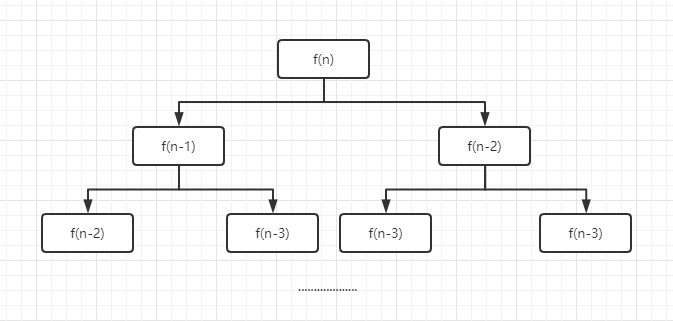

# 动态规划

## 基本思想
动态规划的基本思想是将待求解问题分解成若干个子问题，先求解子问题，再结合这些子问题的解得到原问题的解。  

### 与分治法的区别  
动态规划分解得到的子问题往往不是相互独立的  

### 设计思路
* 找出最优子结构
* 设置边界
* 状态转移
* 求解问题
  
### 如何找出最优子结构
在我们通常的惯性思维中一般都是以子序列的开头为基准，先便利第一个所有的子序列，再遍历第二个。  
但是动态规划为了找不同子序列之间的递推关系，恰恰相反，以子序列的结束点为基准。  

### 实现方式
* 带备忘录的自顶向下法  
此方法仍按自然的递归形式编写过程，但过程会保存每个子问题的解。当需要某个子问题的解时，会首先检查是否已经保存过此解。如果是，则直接返回，否则递归求解。
* 自低向上法
这种方法一般需要恰当定义子问题“规模”的概念，使得任何子问题的求解都只能依赖于“更小的”子问题的求解。因而我们可以将子问题按规模排序，按由小至大的顺序进行求解。

## 实战

### 斐波那契数列
有一对兔子，从出生后第3个月其每个月都生一对兔子。小兔子长到第3个月后每个月又生一对兔子。即第一个月、第二个月有一对兔子，第三个月则变成两对兔子，第四个月变成三对兔子......假设所有的兔子都不死，问每个月的兔子总数为多少。  

#### 思考
首先我们可以试着先求出5个月里每个月的兔子数量变化情况。  
|  月数   | 兔子数量（对）  |
|  ----  | ----  |
| 1  | 1 |
| 2  | 1 |
| 3  | 2 |
| 4  | 3 |
| 5  | 5 |

#### 最优子结构
这里如果以我们常规惯性思维，那么我们是这样看的。第一个月兔子数量为1，第二个月兔子的数量为1，第三个月则为2...。这样我们可以总结出关系前两个月的兔子数量之和为第三个月兔子的数量。那么我们写代码的思维会是这样

```
f(1) + f(2) = f(3)
f(3) + f(2) = f(4)
```
会习惯性的先计算前面的，再计算后面的，这样一步步来。  

但我们现在换个思维，以子序列结束点为基准倒退。那么f(3) = f(2) + f(1)  f(4) = f(3) + (2)，那么这种递推关系就很容易得出状态转移的结构 f(n) = f(n-1) + f(n-2)


接着由于f(1) = 1, f(2) = 1，所以我们的边界也呼之而出。

最后的整体结构如下：
* 找出最优子结构：f(3) = f(2) + f(1)
* 设置边界：f(1) = 1, f(2) = 1
* 状态转移：f(n) = f(n-1) + f(n-2)   (n>=3)

#### 自顶向下

```js
function fib(n) {
  if(n == 1 || n == 2) {
    return 1
  }
  return fib(n - 1) + fib(n - 2)
}
```
虽然递归完整的实现了斐波那契数列，但是我们来看看它的算法时间复杂度。

  

分析出来的结果就是一颗二叉树，树的结点个数就是我们的递归方法所需要计算的次数。输的高度是 n-1，结点个数为 2^(n-1)。所以时间复杂度为 O(2^n)。  

加上备忘录法： 

由于上面递归过程很多数值计算过程中被重复计算。像求f(n)时已经求了f(n-2)，但在求fib(n-1)又求了以一遍f(n-2)。所以我们能用一个将计算过的数据缓存起来，在将来再用需要用到时直接从缓存表中获取缓存结果。
```js
let table = [];
function fib(n) {
  if(n == 1 || n == 2) {
    return 1
  }
  if(table[n]) {
    return table[n]
  }
  return table[n] = fib(n - 1) + fib(n - 2)
}
```
这样时间复杂度和空间复杂度都变成了 0(n)。  

#### 自低向上
上面的思路都是自顶向下的求解，那么我们能不能换个思路呢，从自低向上求解？  
```js
let table = [];

function fib(n) {
  table[1] = table[2] = 1
  for(let i=3; i<=n; i++) {
    table[i] = table[i-1] + table[i-2]
  }
  return table[n]
}
```
上面的代码其实我们还可以再优化一下。我们想一想，其实每次相加只需要前面两个，就是求f(4)的时候，我们只需要知道f(3)和f(2)，f(1)其实已经不需要了。
```js
function fib(n) {
  let a = 1, b = 1, temp;
  for(let i=3; i<=n; i++) {
    temp = a + b
    a = b
    b = temp
  }
  return temp
}
```
这样空间复杂度就从 O(n) 缩小成 O(0) 了。


