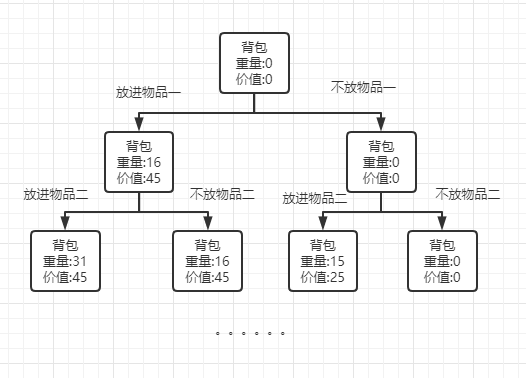
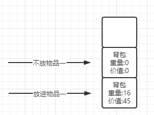
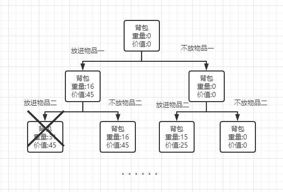

# 分支限界法

分支限界法类似回溯法，也是在问题的解空间上探索问题解的算法。只不过回溯法的求解目标是找出满足条件的所有解，而分支限界法知识寻找某种意义下的最优解。  

## 基本思想
分支限界法常以广度优先的方式搜索问题的解空间树。分支限界法与回溯法的主要区别在于它们对当前扩展结点所采用的扩展方式不同。在分支限揭发中，每个活结点只有一次机会成为扩展结点。活结点一旦成为扩展结点，就一次性产生其所有儿子结点。在这些儿子结点中，导致不可行解或导致非足有解的儿子结点被舍弃，其余儿子结点加入活结点中。  

### 实现方式
#### 队列式分支限界法
将激活的结点组织成一个队列，并按队列的先进先出原则选取下一个结点为当前扩展结点。

#### 优先队列分支限界法
最队列的基础上，新增一个数值 p 来对队列进行排序，让优先级高的结点优先出队执行。

### 图解
#### 0-1 背包问题
现在假设有一个背包的承受力为30斤。现在有三件物品，重量分别为 16、15和15，其相应价值为 45、25和25。问如何才能实现背包放的物品价值最大？  

由于分支界限法是采用广度遍历的方式，所以我们得先把问题变成树形结构： 
  
从图中我们可以看到只要从根节点开始遍历，一层一层地往下走，直到最后一层后，我们就能得出最优解。  

当每遍历一层时，都得用队列来保存下一层需要遍历的结点。  
  
例如当遍历根节点时，就会有两个子节点，一个是放进物品一，一个是不放物品一。两个结点分别进队列。  
当根结点这一层遍历完成，进入下一层的时候。就会取出队列的值进行新的层遍历，新的层的子节点又开始相序进入队列。就这样不断循环，直到最后的结点。  

当然有些结点其实我们是不需要的，例如当放进物品一和物品二时，背包的重量其实已经超过30的上限了，那么其结点和其子节点我们都可以放弃不进队列。 
   
对于这样的无效结点判断删除，我们称之为上界函数.

## 代码实现

### 0-1背包问题

#### 队列式

```js
const N = 3 // 结点成熟
const MAXWEIGHT = 30 // 背包能承受的最大重量
let w = [16, 15, 15] // 物品的重量
let v = [45, 25, 25] // 物品的价值
let maxV = 0 // 最大价值

class Node {
  constructor(level, totalW, totalV) {
    this.level = level
    this.totalW = totalW
    this.totalV = totalV
  }
}

function max(x, y) {
  return x > y ? x : y
}

function solve() {
  let queue = new Queue(20)
  queue.enQueue(new Node(-1, 0, 0))
  while(!queue.isEmpty()) {
    let node = queue.deQueue()
    maxV = max(maxV, node.totalV)
    if(node.level > N) continue
    // 该物品不放进背包的情况
    queue.enQueue(new Node(node.level + 1, node.totalW, node.totalV))
    // 该物品放进背包的情况
    if(node.totalW + w[node.level + 1] <= MAXWEIGHT) {  // 上界函数
      queue.enQueue(new Node(node.level + 1, 
      node.totalW + w[node.level + 1], 
      node.totalV + v[node.level + 1]))
    }
  }
}

solve()
```


