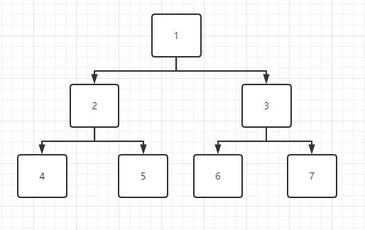
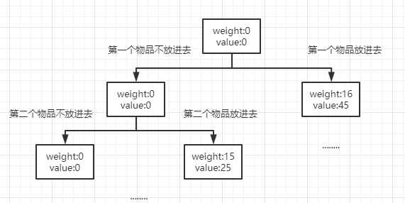

# 回溯法
回溯法有”通用的解题法“之称，使用纯暴力的方式去解决一个问题的所有解或任一解。  

## 基本思想
回溯法是以深度优先方式系统搜索问题的解。  

从根节点为活结点开始，每当扩展下一层子结点时，就会以下一层子结点为活结点。就这样一层一层的遍历下去，直到叶子结点，然后进行回溯上一个节点为活结点，去寻找活结点的其它子节点。

### 图解
  
因为回溯法采用的是深度遍历方式，所以遍历顺序会是 1 - 2 - 4 - 5 - 3 - 6 - 7  

深度遍历为什么能从 4 到 5呢？其实就是回溯了，当遍历到达叶子结点后，就会回溯到上一层，看看上一层有没有其它子节点，有就走新节点，没有就继续回溯。

### 约束条件
回溯法一般会有约束条件，用来裁剪不必要的分支。例如：当上图遍历到结点3 时，发现其结点以及其结点的孩子结点都不能满足要求，那么就会将结点3 裁剪掉，不再对其进行深度遍历。

### 回溯框架

#### 子集树
子集树一般用来解决组合问题
```js
function backtrack(t) {
  if(t > n) {
    output(x)
  }else {
    x[t] = 0
    if(约束条件) {
      backtrack(t+1)
    }
    x[t] = 1
    if(约束条件) {
      backtrack(t+1)
    }
  }
}
```


#### 排列树
子集树一般用来解决排列问题
```js
function backtrack(t) {
  if(t > n) {
    output(x)
  }else {
    for(let i=0; i<=n; i++) {
      swap(x[t], x[i])
      if(约束条件) {
        backtrack(t+1)
      }
      swap(x[t], x[i])
    }
  }
}
```

## 实战

### 0-1 背包问题
现在假设有一个背包的承受力为30斤。现在有三件物品，重量分别为 16、15和15，其相应价值为 45、25和25。问如何才能实现背包放的物品价值最大？  

因为这是一种组合问题的解决，所以整体框架就要用到子集树来写。其主要思路如下：  
  

由图可以看出，左分子是不放进背包，有分子是放进背包，然后构成了一颗二叉树。我们现在只要对其进行深度遍历就能得到所有的结果。  

```js
const N = 3
const MAXWEIGHT = 30   // 背包能承受的最大重量
let weight = [16, 15, 15]  // 物品的重量 
let value = [45, 25, 25]   // 物品的价值
function legal(w) {  // 设置边限
  return w <= MAXWEIGHT
}

function backtrack(t, totalWeight, totalValue) {
  if(t == N ){
    console.log('重量为：' + totalWeight +' 价值为:' + totalValue)
  } else {
    if(legal(totalWeight)) backtrack(t+1, totalWeight, totalValue)
    totalWeight+=weight[t]
    totalValue+=value[t]
    if(legal(totalWeight)) backtrack(t+1, totalWeight, totalValue)
  }
}

backtrack(0, 0, 0)

// 重量为：0 价值为:0
// 重量为：15 价值为:25
// 重量为：15 价值为:25
// 重量为：30 价值为:50
// 重量为：16 价值为:45
```
如果想保存路径的话，我们可以添加个path来保存
```js
let path = []

if(legal(totalWeight)) {
  path[t] = 0
  backtrack(t+1, totalWeight, totalValue)
}
totalWeight+=weight[t]
totalValue+=value[t]
if(legal(totalWeight)){
  path[t] = weight[t]
  backtrack(t+1, totalWeight, totalValue)
}
```

### 排序问题
请输出 1 2 3 4 5 所有的排列方式

```js
const N = 3
let x = [1, 2, 3]

function output() {
  console.log(x.toString())
}

function swap(i, j) {
  let tmp = x[i]
  x[i] = x[j]
  x[j] = tmp
}

function backtrack(t) {
  if(t == N ){
    output()
  } else {
    for(let i=t; i<N; i++) {
      swap(i, t)
      backtrack(t+1)
      swap(i, t) // 回溯到原来的位置
    }
  }
}

// 1,2,3
// 1,3,2
// 2,1,3
// 2,3,1
// 3,2,1
// 3,1,2
```

### 笛卡尔乘积
```js
const N = 3
let res = []
let x = [['男裤', '女裤'], ['S', 'L'], ['黑色', '白色']]

function backtrack(arr, index, temp, N) {
  if(temp.length == N ){
    res.push(JSON.parse(JSON.stringify(temp)))
  } else {
    for(let i=0; i<arr[index].length; i++) {
      temp.push(arr[index][i])
      backtrack(arr, index+1, temp, N)
      temp.pop()
    }
  }
}
backtrack(x, 0, [], N)
```