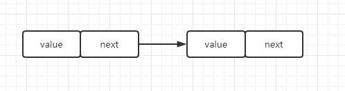
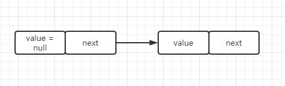
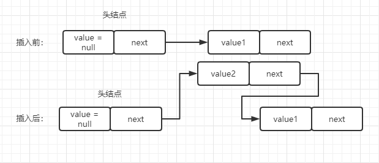
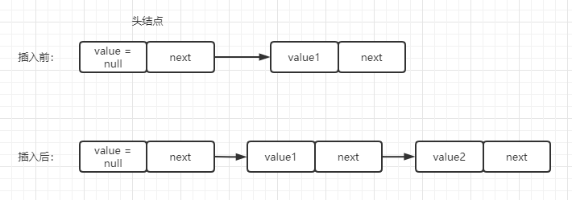
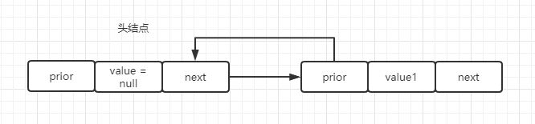
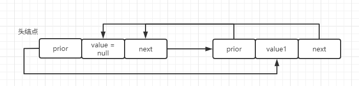
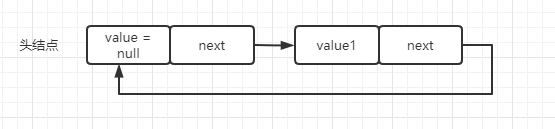

# 线性表

线性表是一种典型的线性结构，也是一种最常用的数据结构。其实现方式有两种：顺序结构和链式结构。  

## 顺序表
线性表的顺序存储结构称为顺序表，顺序表是把线性表中的所有元素按照其逻辑顺序依次存储到计算机中的一块连续的存储空间。  

顺序表的实现比较简单，因为需要保持其数据逻辑上的顺序，所以一般都是使用数组来实现。  
```js
class SqList {
  constructor(n) {
    this.arr = new Array(n)
    this.length = 0
  }

  listEmpty() { // 判断是否是空表
    return this.length == 0
  }

  listLength() { //返回线性表的长度
    return this.length
  }

  LocateElem(value) { // 查找值查找
    for(let i=0; i<this.length;i++) {
      if(this.arr(i) === value) return i
    }
    return -1
  }

  getElem(index) {  // 根据索引获取值
    if(i > this.length) return -1
    return this.arr[index]
  }

  listInsert(index, value) { //指定索引插入值
    let i
    if(index < 0 || index > this.length || (this.length + 1) > this.arr.length) {
      return false
    }
    for(i = this.length; i>index; i--) {
      this.arr[i] = this.arr[i-1]
    }
    this.arr[i] = value
    this.length++
    return true
  }

  listPush(value) { //直接在最后插入值
    if(this.length >= this.arr.length) return false
    this.arr[this.length] = value
    this.length++
  }

  dispList() { // 输出整个顺序表
    for(let i=0; i<this.length;i++) {
      console.log(this.arr[i])
    }
  }
}
```
因为 JavaScript 的数组长度是可以随时改变的，所以为了保证其长度的限制都会做限制判断。  
以上只是顺序表的部分功能实现，想一些删除等操作，你们可以自行添加进去。  

::: tip
因为顺序表主要采用数组来实现，所以数组的优缺点就是顺序表的优缺点。  

优点：
* 获取值迅速，只要根据索引的下标即可。其算法复杂度为 O(1)
* 实现较为简单，不需要额外的结点。所以比内存利用率比较高

缺点：
* 插入和删除值困难。像上面的 listInsert 方法插值，需要把后面元素逐个位移（删除也是如此）。
* 数组的值数量有限（当然JS没有这个限制，不过JS会分为快数组和慢数组），如果一开始就给很大的数组长度，而之后又用不到，那么就会很浪费内存，反之则是长度不够用。

:::

## 链式表
顺序表必须占用一整块事先分配大小的存储空间，这样会降低存储空间的利用率。那么我们可以通过链式操作，即每个值都会有额外的一个变量来指向下一个值。像下图所示：  

  

所以我们的实现创建这样一个结点。 

```js
class Node {
  constructor(value, next = null) {
    this.value = value  // 该结点的值
    this.next = next  // 指向下一个结点，没有就位 null
  }
}
```

链表创建有两种方式，一种是不带头结点，一种是带头结点。  
* 不带头结点就是首个结点就是拥有值得结点。
* 带头结点就是首个结点是一个无意义的结点，该结点没有值，只是使用一个 next 来方便操作。

为了方便实现链式表，所以本文使用了带头结点方式。即第二结点开始才是正式的值。 
   

在实现链表前，我们先了解链表是如何插入数据的   
* 头插法  
顾名思义，就在链表的头部插入结点，。而我们这里由于使用了带头结点的链表，那么则是在头结点后插入。  
   

* 尾插法  
在链表的最后插入，如图所示：
   

链表代码实现  
```js
class LinkNode {
  constructor() {
    this.node = new Node()
  }

  insertR(node) { // 尾插法
    let linkNode = this.node
    while(linkNode.next != null) {
      linkNode = linkNode.next
    }
    linkNode.next = node
  }

  insertF(node) { // 头插法
    node.next = this.node.next
    this.node.next = node
  }

  destroyNode(value) { // 删除结点
    let linkNode = this.node.next
    let lastNode = this.node
    while(linkNode) {
      if(linkNode.value === value) {
        lastNode.next = linkNode.next
      }
      lastNode = linkNode
      linkNode = linkNode.next
    }
  }

  dispLink() { // 输出结点
    let linkNode = this.node.next
    while(linkNode) {
      console.log(linkNode.value)
      linkNode = linkNode.next
    }
  }
}
```
此链表实现还不完整，例如：中间插值 等均未实现。  

::: tip
优点：
* 插入和删除简单，只需要修改 next 执行即可
* 不限制长度，数量可以自行根据需要添加和减少

缺点：
* 查找值困难，必须遍历。不能想顺序表用下标来直接获取值。
* 内存利用率不高，因为每个节点都有额为的 next 属性。

:::

## 补充  

### 双链表
以上实现的是单链表。而所谓的双向列表则是在 Node 中添加多一个指向上一个节点的值。 
```js
class Node {
  constructor(value, next = null, prior) {
    this.value = value  // 该结点的值
    this.next = next  // 指向下一个结点，没有就 null
    this.prior = prior // 指向上一个结点，没有就 null
  }
}
```

  

### 循环链表
循环列表则是重复利用头结点和尾节点的 prior 和 next 的空闲，是它们分别指向尾节点和头结点。  

#### 双链表的循环链表
  

#### 单链表的循环链表
  