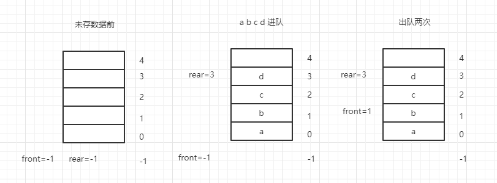
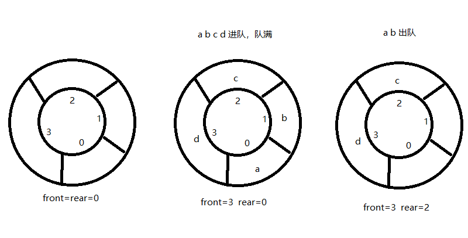
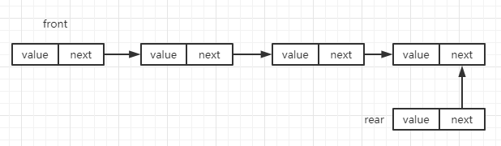

# 队列
队列简称队，它也是一种操作受限的线性表，其限制为仅允许在表的一端进行插入操作，而在表的另一端进行删除操作。  

## 队列的结构

### 队头和队尾
* 队尾：把进行插入的一端称为队尾(rear)
* 队头：把进行删除的一端称为队头(front)

### 进队和出队
* 进队：队列的插入新元素的操作
* 出队：队列的删除元素的操作

### 先进先出
由于队列的插入和删除操作分别是在各自的一端进行的，每个元素必然按照进入的次序出队，所以又把队列称为先进先出表。  

## 队列的实现

### 顺序存储结构

#### 说明
队列的顺序结构就像线性表的顺序结构一样，用数组来存储数据。然后用 rear 指向队尾的下标，front 指向队头的下标。  

#### 图演示
  

#### 代码演示
```js
class Queue {
  constructor(n) {
    this.data = new Array(n)
    this.front = -1
    this.rear = -1
  }

  isEmpty() {
    return this.front == this.rear
  }

  enQueue(value) {
    if(this.rear == this.data.length - 1) return false //队满上溢出
    this.rear++
    this.data[this.rear] = value
    return true
  }

  deQueue() {
    if(this.front == this.rear) return false //队空上溢出
    this.front++
    return this.data[this.front]
  }
}
```

以上就是一个简单的队列实现了。不过这样的队列还会有一个假溢出问题。  
就是当 this.rear == this.data.length - 1 时，这时即使我出队两个元素，让队列有两个坐标为0 和 1空位了。但是入队里面却会依然判断为满了。  


#### 循环(环形)队列
解决的方法是把 data 数组的前端和后端连接起来，形成一个环形数组，如下图所示：  
  
环形队列首位相连后，当队尾指针 rear = data.length - 1 后，在前进一个位置就到达 0，从可以循环利用资源。  

循环队列关键点是如何让指针循环指向，这时可以采用数学上的求余运算来实现：  
```js
front = (front + 1) % this.data.length
rear = (front + 1) % this.data.length
```

然后队满的情况下也有所不同   
```js
(rear + 1) % this.data.length == front
```

最终代码演示:  
```js
class Queue {
  constructor(n) {
    this.data = new Array(n)
    this.front = 0  
    this.rear = 0 
    this.maxSzie = n
  }

  isEmpty() {
    return this.front == this.rear
  }

  enQueue(value) {
    if((this.rear + 1) % this.maxSzie == this.front) return false //队满上溢出
    this.rear = (this.rear + 1) % this.maxSzie
    this.data[this.rear] = value
    return true
  }
  deQueue() {
    if(this.front == this.rear) return false //队空上溢出
    this.front = (this.front + 1) % this.maxSzie
    return this.data[this.front]
  }
}
```
这里添加了一个 maxSzie 变量来代替 this.data.length，方便书写。  

::: tip
* 循环队列会有一个空位不能使用，即 this.front 所在位置
:::

### 链式存储结构

#### 说明
队列中数据元素的逻辑关系呈线性关系，所以队列可以像线性表一样采用链式存储结构。front 指向头结点，rear 指向为结点。插入从 rear 方向插入，删除从 front 删除。

#### 图演示
  

#### 代码演示
首先实现链表的结点
```js
class Node {
  constructor(value, next = null) {
    this.value = value
    this.next = next
  }
}
```

带头结点的链式代码：
```js
class Queue {
  constructor() {
    this.front = new Node()
    this.rear = new Node()
  }

  enQueue(value) {
    let node = new Node(value)
    if(this.rear.next == null) {  // 空的情况
      this.front.next = this.rear.next = node
    }else {
      this.rear.next.next = node
      this.rear.next = node
    }
    return true
  }

  deQueue() {
    if(this.rear.next = null) {  // 空的情况
      return false
    }
    let node = this.front.next
    if(this.rear.next == this.front.next) {  // 只有一个结点是
      this.rear.next = this.front.next = null
    }else {
      this.front.next = this.front.next.next
    }
    return node
  }

  dispLink() {
    let linkNode = this.front.next
    while(linkNode) {
      console.log(linkNode.value)
      linkNode = linkNode.next
    }
  }
}
```