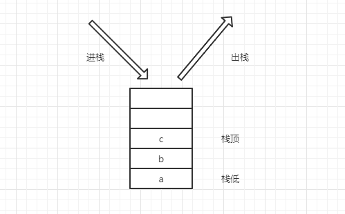

# 栈
栈是一种只能在一端进行插入或删除操作的线性表。

## 栈的结构

### 栈顶和栈低
栈分为栈顶和栈低。  

栈顶：数据插入和删除的地方，也就是说栈顶是动态的，随着插入和删除操作数据变化而变化。  
栈低：栈的底端。

### 出栈和进栈
插入操作被称为 进栈。  
删除操作被称为 出栈。  

### 后进先出原则
栈遵循着后进先出原则。如图所示：a、b、c依次进栈，然后如果执行出栈操作那么必然先出栈 c，再到b 和 a，而不能直接跳过 c 直接出栈 b 和 a。 

  


## 栈的实现
栈中数据元素的逻辑关系呈线性关系，所以栈可以像线性表一样采用顺序结构进行存储。所以实现栈的方式也分为两种：一种采用数组实现的顺序结构，一种为链式实现的栈式结构。
### 栈的顺序存储结构实现

```js
class Stack {
  constructor(n) {
    this.data = new Array(n)
    this.top = -1
  }

  isEmpty() { // 判断栈是否为空
    return this.top === -1
  }

  push(value) { // 进栈
    if(this.top == this.data.length - 1) { // 栈满
      return false
    }
    this.top++
    this.data[this.top] = value
    return true
  }

  pop(value) {
    if(this.top === -1) { // 栈空
      return false
    }
    this.top--
    return true
  }

  getTop() { // 取栈顶元素
    if(this.top === -1) { // 栈空
      return false
    }
    let res = this.data[this.top]
    return res
  }
}
```
使用数组来存储数据，再添加一个变量 top 来充当指针，指向当前栈顶的位置。每次进栈就是 top+1，出栈就使 top-1。  

### 栈的链式结构

首先实现链表的结点
```js
class Node {
  constructor(value, next = null) {
    this.value = value
    this.next = next
  }
}
```

接着实现栈的链式结构。由于栈的特点是后进先出的原则，所以需要采用头插法。删除结点也需要改成删除首结点，以达到删除后进的结点。  
```js
class Stack {
  constructor() {
    this.node = new Node() // 新建一个头结点
  }

  isEmpty() {
    return this.node.next == null
  }

  push(node) { // 头插法
    node.next = this.node.next
    this.node.next = node
  }

  pop() {
    if(this.isEmpty()) return false
    this.node.next = this.node.next.next
    return true
  }

  getTop() { // 取栈顶元素
    return this.node.next
  }

  dispLink() {
    let linkNode = this.node.next
    while(linkNode) {
      console.log(linkNode.value)
      linkNode = linkNode.next
    }
  }
}
```
