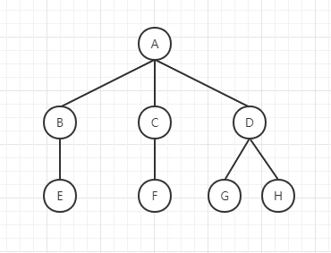
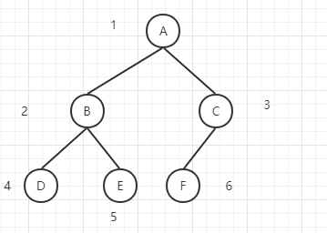
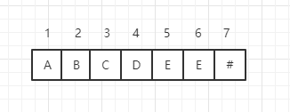
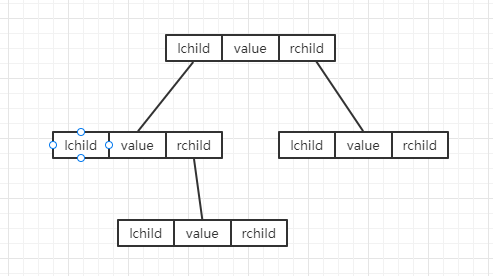

# 树
树是由n(n>=0)个结点（或元素）组成的有限集合。

## 树的基础
想要了解树，必须先了解树的一些术语。不过在此之前，想让我们来看看一个课树是什么样的。  
   
图中就是树的树形表示法。A为该树的根节点。  

### 基本术语

* 结点的度与树的度  
树中某个结点的子树的个数称为该结点的度。(B的度为1，而D的度为2)。而树中所有结点的度中最大值为树的度。
* 分支结点与叶子结点  
树中度不为零的结点称为分支结点（B、C等）。而叶子结点则相反，是度为0的结点（E、F等）。
* 路径和路径长度  
路径是树中的一个结点到达另一个结点所走过的结点，而路径长度则是所走过结点的数。例如A到G的路径为（A、D、G），路径长度为2。  
* 孩子结点、双亲结点和兄弟结点  
在一棵树中，每个节点的后继结点被称为孩子结点（E为B的孩子结点），相反过来该节点也是孩子的双亲结点（相当于父结点，B为E的双亲结点）。兄弟结点则是后继结点的双亲结点是同一个（G、H是兄弟结点）。
* 结点层次和树的高度  
树的根节点为第一层，从上往下数直到该结点，那么结果就为结点的层次（E的层次为3）。而树的高度则是结点最大的层次（该树为3）

## 二叉树
孩子结点最大为2个的树，并且严格区分左孩子结点和右孩子结点的树称之为二叉树。是一种典型的树。适合入门学习的人理解，所以本文将以二叉树为例子进行树的实现。  

### 二叉树的顺序结构
其实二叉树的的线性结构非常容易。如果我们给每个节点一个从上到下，从左到右的序号的话。就会发现一些规律。  
  
如果一个结点有双亲结点，那么该结点的双亲结点的序号为 [i/2]。反过来，如果一个结点有孩子结点，那么其孩子结点的序号为 [2i] 左孩子和 [2i+1] 右孩子。对应的顺序结构图为如下：   
  
其对应的代码：  
```js
const treeArr = []
```

#### 优点
顺序存储结构适合完全二叉树或满二叉树，既能够最大可能地节省存储空间，又可以利用数组元素的下标确定结点在二叉树的位置以及结点之间的关系。

#### 缺点
既然使用顺序结构来实现，那么就会有顺序结构固有的缺点。这使得二叉树的插入、删除等运算十分不方便。因此，对于一般二叉树通常采用链式存储方式。

:::tip
完全二叉树：最下面两层的结点的度数可以小于2，并且最下面的一层的叶子结点都一次排列在改成最左边的位置上（如上图：就是一颗完全二叉树）  
满二叉树：所有分子结点都有左孩子结点和右孩子结点（如上图：分支结点 C 再添加多一个右孩子结点）
:::

### 二叉树的链式结构
链式结构其实跟链双向链表一样，用两个值来分别指向左孩子结点和右孩子结点。  
  
其代码实现如下：
```js
class Node {
  constructor(value, lchild = null, rchild = null) {
      this.value = value
      this.lchild = lchild
      this.rchild = rchild
    }
}
```
这样我们只要创建一个根节点，然后往里面添加孩子结点就能形成一颗二叉树了。  

查找某个结点 
```js
function findNode(node, x) {
  let p
  if(node == null) {
    return null
  }else if(node.value == x) {
    return node
  }else {
    p = findNode(node.lchild)
    if(p!=null) return p
    return findNode(node.rchild)
  }
}
```

## 二叉树的遍历
二叉树的遍历是指按照一定的次序访问二叉树中的所有结点，并且每个节点仅被访问一次的过程。（以下实现均为链式存储结构） 

 
### 先序遍历
从根节点开始，优先遍历左子树。那么上图的先序遍历的顺序为：    
ABDECF

代码实现
```JS
function preOrder(node) {
  if(node != null) {
    console.log(node.value)
    preOrder(node.lchild)
    preOrder(node.rchild)
  }
}
```
### 中序遍历
先左子树再到父结点最后右子树。那么上图的中序遍历的顺序为：  
DBEAFC

代码实现
```JS
function preOrder(node) {
  if(node != null) {
    preOrder(node.lchild)
    console.log(node.value)
    preOrder(node.rchild)
  }
}
```
### 后序遍历
先右子树再到左子树最后父结点。那么上图的中序遍历的顺序为：
EDBFCA

代码实现
```JS
function preOrder(node) {
  if(node != null) {
    preOrder(node.lchild)
    preOrder(node.rchild)
    console.log(node.value)
  }
}
```