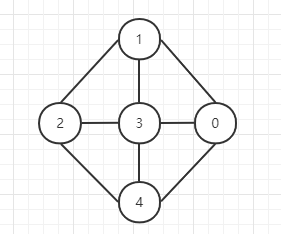
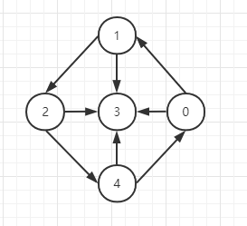
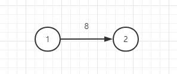
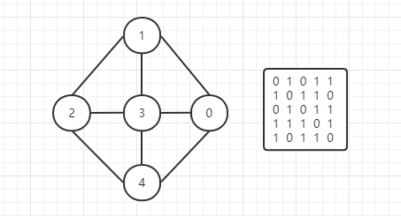
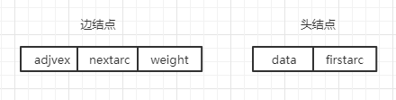
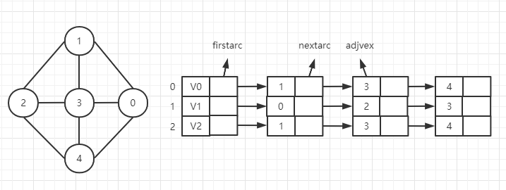

# 图

## 图的定义
无论多么复杂的图都是由顶点和边构成的。采用形式化的定义，图 G 由两个集合 V 和 E 组成。其中 V 是顶点的有限集合，E 是边的有限集合。  
  
如上图该图的顶点和边的集合分别为：   
V(G) = { 0, 1, 2, 3, 4 }  
E(G) = { (1,2), (1,3), (1,0), (2,3), (3,0), (2,4), (3,4), (4,0)}  

其中(i, j)说明, i能到j 和 j亦能到i。说明该图是**无向图**

  
如果是**有向图**，则使用\<i, j\>来表示，说明 i 能到 j。如上图<1, 2>说明 顶点1 能连通 顶点2。  

## 图的基本术语

### 端点和邻接点
在无向图中，若存在一条边(i, j)，则称顶点i 和 顶点j 为该边的两个端点，并称它们互为邻接点  
在有向图中，若存在一条有向边\<i, j\>，则称顶点i 为此边的起始端点（起点），顶点j为终点端点（终点）。顶点j 是顶点i 的出边邻接点，顶点i 是顶点j 的入边邻接点。  

### 顶点的度、入度和出度
在无向图中，一个顶点所关联的边的数目称为该顶点的度。   
在有向图中，以自身为终点的边的数目称为入度，以自身为起点的边的数目称为出度。而该顶点的度为入度加出度。  

### 完全图
在无向图中的每两个顶点之间都存在着一条边则称之为完全图。  
在有向图中的每两个顶点之间都存在着方向相反的两条边则称之为完全图。  
也就是每个顶点都是互通的  

### 回路和环
若一条路径上的开始点和结束点为同一个顶点，则此路径被称为回路或环。

### 连通、连通图和连通分量
在无向图中，若顶点i 到顶点j 有路径，则称顶点i 和顶点j 是连通的。若图G中任意两个顶点都是连通的，则称改图为连通图。无向图中的极大连通子图称为改图的连通分量。  

### 强连通图和强连通分量
在有向图中，若顶点i 到顶点j 有路径，则称顶点i 和顶点j 是连通的。若 顶点j 到顶点i 也是存在路径，那么该图就是强连通图。有向图中的极大连通子图称为该图的强连通分量

### 权和网
每条边都可以附有一个对应的数组，这种与边相关的数组称为权。边上带有权的兔称为带权图（网）  
 


## 图的实现

### 邻接矩阵
邻接矩阵实际上就是用一个二维数组来存储每个顶点之间的关系。  
   
如上面的无向图的数组则是使用 0 来代表不连通 1 代表连通。A[2][1]=1 则是说明顶点2 到顶点1 是连通的。如果该图带权则是使用权值为代表连通，无穷大（或其他）为不连通，0位两个顶点一样。  

有向图则是与有向图表达方式一致

```js
class Node {
  constructor(no, value) {
    this.no = no  // 顶点编号
    this.value = value  // 顶点值
  }
}

class Graph {
  constructor() {
    let edges = []
    let n, e   // 存放顶点数和边数
    let vexs = []  // 存放顶点信息
  }
  init(max) {
    for(let i=0;i<max;i++) {
      this.edges.push(new Array[max])
    }
  }
}
```

优点与缺点：  
* 存储边的数目比较多时才不会浪费过多内存，因为无论你存多少，邻接表都会创建一个相应的二维数组
* 无向图的邻接矩阵一个是个对称矩阵，可以采用压缩存储
* 对于无向图，邻接矩阵的第i行或列的非零元素个数正好是该点的度，而有向图正好是出度或入度
* 获取权的执行时间为O(1)

### 邻接表
邻接表是一种顺序与链式相结合的存储方法。其原理是顺序结构存储图的顶点，然后使用链式的方式来存储与该点连通的顶点。  

邻接表中有两种结点类型，一种是头结点，表示图中的顶点。另一种是边结点。 
   
其完整的邻接表展示：  
    
 
代码实现
```js
class ANode {
  constructor(adjvex, nextarc, weight) {
    this.adjvex = adjvex
    this.nextarc = nextarc
    this.weight = weight
  }
}

class Vnode {
  constructor(value, firstarc) {
    this.value = value
    this.firstarc = firstarc
  }
}

class Graph {
  constructor(max) {
    this.adjlist = new Array(max)  //使用顺序存储结构存储顶点
    let e    // 边数
  }
}
```
