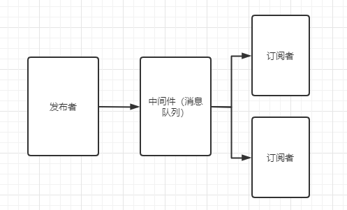

# 发布订阅模式

## 什么是发布订阅模式
发布订阅模式是一种定义对象间的一种一对多的依赖关系，当一个对象的状态发生改变时，所以依赖于他的对象都将得到通知。  

在发布订阅模式里，发布者，并不会直接通知订阅者。而是通过第三者，也就是消息队列来进行通知。  



::: tip
发布订阅模式与观察者模式的区别在于，观察者模式是直接自己来通知变化
:::

## 实现发布订阅模式
发布订阅模式可以分成三个部分：  
1. 发布者：能发布消息
2. 调度中心：发布者发布的消息是通过调度中心来通知订阅者
3. 订阅者：能订阅发布者

现在我们来实现一个发布订阅模式。让我们来假设有一个这样的需求：吃鸡玩家在匹配对手时，由服务器来寻找对手，当对手找到后，服务器就会通知玩家进行准备连接。
### 调度中心
首先实现调度中心，也就是我们的服务器。
```js
let event = {
    list: {},
    on(key, user) {
        if(!this.list[key]) {
            this.list[key] = []
        }
        this.list[key].push(user)
    },
    emit() {
        let key = [].shift.call(arguments)
        users = this.list[key]
        if (!users || users.length === 0) {
            return false
        }
        users.forEach(user => {
            user.connect()
        })
    },
    remove(key, user) {
        let fns = this.list[key]
        if(!fns) return false

        fns.forEach((cb, i) => {
            if (cb === user) {
                fns.splice(i, 1);
            }
        })
    }
}
```
调度中心提供了发布(emit)、订阅(on)和取消订阅功能(remove)，并且订阅用户的数据由 list 保存。在用户订阅时根据用户订阅的类型往 list 里面存储用户。用户发布时，也是根据发布类型来循环遍历里面的用户进行通知。  

### 订阅者
接下来我们实现订阅者，也就是游戏用户玩家。当玩家匹配成功时，就会调用 connect 连接相应的服务器功能
```js
function Person(name) {
    this.name = name
}
Person.prototype.connect = function() {
    console.log(`对手已匹配到，请${this.name}点击准备`)
}
```

### 发布者
```js
function Server(name) {
    this.name = name
}
Server.prototype.notice = function() {
    event.emit('match')
}
```

### 测试代码
```js
let serve = new Server('服务器')
let player1 = new Person('青铜大佬')
let player2 = new Person('白银大佬')
// 青铜大佬开始匹配
event.on('match', player1)
// 白银大佬开始匹配
event.on('match', player2)
// 服务器匹配完毕，通知所有匹配到的人
serve.notice()

// 对手已匹配到，请青铜大佬点击准备
// 对手已匹配到，请白银大佬点击准备
```
根据《JavaScript设计模式与开发实践》一书中说了分辨模式的关键是意图而不是结构。所以我们在使用设计模式的时候要灵活运用，而不是照抄模仿式实现。  

比如我们前端根据需要可以把发布订阅模式改成这样
```js
class Messager {
  send(eventName, payload) {
    document.dispatchEvent(new CustomEvent(eventName, {
      detail: {
        payload
      }
    }))
  }

  receive(e, messageHandler) {
    if(messageHandler) {
      const payload = e.detail.payload
      messageHandler(payload)
    }
  } 
}
```
这里的发布订阅模模式的调度中心不再是通过数组遍历来通知了，而是通过自定义事件巧妙的运用了前端的事件机制来达到通知效果。  
发布者通过使用自定义事件来通知订阅者 
```js
Messager.send('事件名称', {
    key: this.toolbarList[index].key
})
```
订阅者则通过监听document的事件来实现收到通知
```js
document.addEventListener('事件名称', this.receive)
```