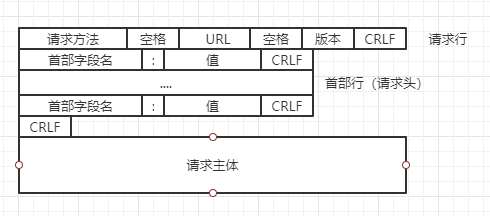
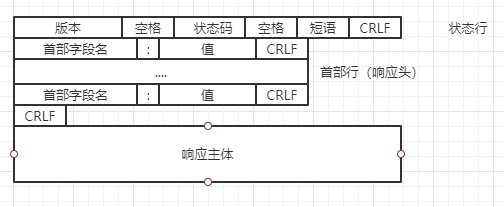

# HTTP

## HTTP 协议
HTTP协议是Hyper Text Transfer Protocol（超文本传输协议）的缩写，是使用了面向连接的TCP作为运输层协议，是用于从万维网（WWW:World Wide Web ）服务器传输超文本到本地浏览器的传送协议。  

重点：使用了 TCP 作为运输层协议，也就是说HTTP是在TCP/IP协议的基础上运作，是属于 TCP/IP 内部的一个子集。

### HTTP的报文结构
HTTP 报文结构有两种，分别是请求报文和响应报文。  

#### 请求报文
从客服端向服务器发送请求报文，详情如下图所示
   
1. 请求行，表明了方法(GET、POST等)、请求资源URL以及HTTP版本
2. 首部行，用来说明游览器、服务器或报文主体的一些信息。通常由字段名和字段值构成。  
3. 请求主体

#### 响应报文
从服务器到客户的响应  
  
1. 响应行，表明了状态码（200、404、500等）以及HTTP版本
2. 首部行，用来说明游览器、服务器或报文主体的一些信息。通常由字段名和字段值构成。  
3. 响应主体，一般是请求后返回的数据  

## HTTP/1.1首部行字段

### Cache-Control
控制着游览器是否使用缓存和缓存时间设置等。常用的值有： 
* public: 可以被所有的用户缓存，包括终端用户和 CDN 等中间代理服务器。
* private: 只能被终端用户的浏览器缓存，不允许 CDN 等中继缓存服务器对其缓存。
* no-cache: 需要进行协商缓存，发送请求到服务器确认是否使用缓存。
* no-store: 禁止使用缓存，每一次都要重新请求数据。
* max-age: 设置缓存有效时间，是相对时间的长度

```
Cache-Control: no-cache
```

### Connection
控制不再转发给代理的首部字段
```
Connection: 不再转发的首部字段名
```
  
管理持久连接  
```
Connection: close/Keep-Alive
```
HTTP/1.1默认连接都是持久连接。如果想明确断开连接就指定值为 close

### Date
表明创建HTTP报文的日期时间
```
Date: Tue, 03 Jul 2012 04:40:59 GMT
```

### Transfer-Encoding
规定了传输报文主体时采用的编码方式。在 HTTP/1.1 中仅对分块传输编码有效
```
Transfer-Encoding: chunked
```

### Accept
通知服务器用户能处理的媒体类型及媒体类型的优先级
```
Accept: text/html,application/xml
```

### Location
重定向，由服务器响应告知
```
Location: http://www.xxx.com
```

### Content-Type
Content-Type 标头告诉客户端实际返回的内容的内容类型。
```
Content-Type: text/html,application/xml
```
值跟Accept相似

## HTTP 状态码
|     | 类别  |  原因  |
|  ----  | ----  | ----  |
| 1XX  | Informational(信息性状态码) | 接受的请求正在处理 |
| 2XX  | Success(成功状态码) | 请求正常处理完毕 |
| 3XX  | Redirection(重定向状态码) | 需要进行附加操作以完成请求 |
| 4XX  | Client Error(客户端错误状态码) | 服务器无法处理请求 |
| 5XX  | Sercer Error(服务器错误状态码) | 服务器处理请求出错 |

### 2XX 成功
* 200 OK
* 204 No Content: 请求已处理成功，但没有资源返回
* 206 Partial Content: 客户端进行范围请求，而服务器端也成功执行了这部分GET请求

### 3XX 重定向
表明游览器需要执行某些特殊的处理以正确处理请求
* 301 Moved Permanently: 该状态码表示请求的资源已被分配了新的URI
* 302 Found: 临时性重定向，希望用户本次使用新的URI访问
* 303 See Other: 请求对应的资源存在着另一个URI，应使用GET方法定向获取请求的资源
* 304 Not Modified: 服务器资源没有改变，可以直接使用客户端未过期的缓存
* 307 Temporary Redirect: 临时重定向，跟302基本一样，只能使用POST

### 4XX 客户端错误
表明客户端是发生错误的原因所在
* 400 请求报文中存在语法错误
* 401 请求需要通过有HTTP认证的认证信息
* 403 Forbidden：请求资源的访问被服务器拒绝了
* 404 Not Found: 服务器上无法找到该请求资源

### 5XX 服务器错误
表明服务器本身发生错误
* 501 服务器在执行请求时发生了错误
* 503 服务器暂时处于超负载或正在进行停机维护，现在无法处理请求


## 补充问题

### Get和Post的区别
从本质上来说，Get 和 Post 并没有区别。因为两者都是 HTTP1.0 时定义的三种方法的两个，还有一个则是HEAD。(HTTP1.1新增了六种请求方法：OPTIONS、PUT、PATCH、Delete、TRACE、CONNECT)   
  
当然，竟然封装成了两个方法，那么在使用上肯定会有区别。

### Get
* GET 在浏览器回退时是不会再次发生请求的
* GET 请求会被浏览器主动缓存
* GET 请求参数放在URL，并且会被完整保留在浏览器历史记录
* 由于 GET 请求参数在URL，所以并不安全
* GET 请求在 URL 中传送的参数是有长度限制
* GET 参数只接受ASCII字符
* GET 请求只产生一个 TCP 数据包，只发送一次请求，header 和 data 一起发送

### Post
* Post 在游览器回退时是会再次提交请求
* Post 请求不会被游览器主动缓存，除非手动设置
* Post 请求参数放在请求体中，安全系数高
* Post 请求参数大小没有限制
* Post 能接受任何类型参数
* Post 产生两个 TCP 数据包。这是因为 Post 会发送两次请求，第一次先发送 header，服务器响应 100 continue后，再发送 data

### HTTP1.0 和 HTTP1.1 相比
* 请求方法 HTTP1.1 新增了六种
* 缓存处理：在 HTTP1.0 中主要使用 header 里的 If-Modified-Since, Expires 来做为缓存判断的标
准，HTTP1.1 则引入了更多的缓存控制策略例如 Entity tag，If-Unmodified-Since, If-Match,
If-None-Match 等更多可供选择的缓存头来控制缓存策略。
* 长连接：HTTP 1.1 支持长连接（PersistentConnection）和请求的流水线（Pipelining）处
理。在 HTTP1.0  中每发送一个 HTTP 请求都要建立一次 TCP 连接（3次握手和4次挥手）。这是一件很浪费网络资源的事情。所以在一个 TCP 连接上可以传送多个 HTTP 请求和响应，减少了建立和关闭连接的消耗和延迟，在 HTTP1.1 中默认开启 Connection: keep-alive，一定程度上弥补了HTTP1.0每次请求都要创建连接的缺点。
* Host头处理：在HTTP1.0中认为每台服务器都绑定一个唯一的IP地址，因此，请求消息中的
URL并没有传递主机名（hostname）。但随着虚拟主机技术的发展，在一台物理服务器上可
以存在多个虚拟主机（Multi-homed Web Servers），并且它们共享一个IP地址。HTTP1.1的
请求消息和响应消息都应支持Host头域，且请求消息中如果没有Host头域会报告一个错误
（400 Bad Request）。
* 错误通知的管理：在 HTTP1.1 中新增了24个错误状态响应码，如409（Conflict）表示请求的
资源与资源的当前状态发生冲突；410（Gone）表示服务器上的某个资源被永久性的删除。
* 带宽优化及网络连接的使用：HTTP1.0 中，存在一些浪费带宽的现象，例如客户端只是需要某
个对象的一部分，而服务器却将整个对象送过来了，并且不支持断点续传功能，HTTP1.1则在
请求头引入了 range 头域，它允许只请求资源的某个部分，即返回码是206（Partial
Content），这样就方便了开发者自由的选择以便于充分利用带宽和连接。


### HTTP2.0 和 HTTP1.x 相比
* 新的二进制格式（Binary Format）：HTTP1.x 的解析是基于文本。基于文本协议的格式解析
存在天然缺陷，文本的表现形式有多样性，要做到健壮性考虑的场景必然很多，二进制则不
同，只认0和1的组合。基于这种考虑HTTP2.0的协议解析决定采用二进制格式，实现方便且健
壮。
* 多路复用（MultiPlexing）：即连接共享，即每一个 request 都是是用作连接共享机制的。一
个 request 对应一个 id，这样一个连接上可以有多个 request，每个连接的 request 可以随机的
混杂在一起，接收方可以根据request的 id将request再归属到各自不同的服务端请求里面。
* 多路复用（MultiPlexing）：即连接共享，即每一个request都是是用作连接共享机制的。一
个request对应一个id，这样一个连接上可以有多个 request，每个连接的 request 可以随机的
混杂在一起，接收方可以根据request的 id将request再归属到各自不同的服务端请求里面。
* 服务端推送（server push）：服务端推送能把客户端所需要的资源伴随着 index.html 一起发
送到客户端，省去了客户端重复请求的步骤。正因为没有发起请求，建立连接等操作，所以静
态资源通过服务端推送的方式可以极大地提升速度。例如我的网页有一个 sytle.css 的请求，在
客户端收到 sytle.css 数据的同时，服务端会将 sytle.js 的文件推送给客户端，当客户端再次尝试
获取 sytle.js 时就可以直接从缓存中获取到，不用再发请求了。