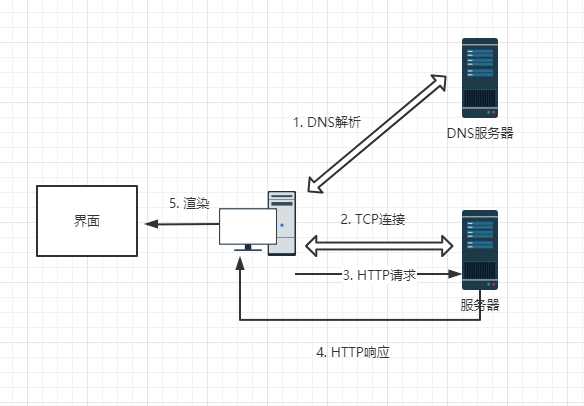

# 从输入URL到页面加载完成，发生了什么？  

## 为什么要懂这个过程
这时一个老生常谈的面试问题了。  

可能很多人还不了解，知道这个知识对自己有什么用？是面试造火箭、进入拧螺丝吗？ 不是的。  

所以本文将从性能优化方向来讲解这个问题。  

## 讲解

### 从输入URL到页面加载完成的流程

  

1. 首先我们需要通过 DNS 将 URL 解析为对应的 IP 地址。（一般游览器本地会存在缓存，所以会先从缓存查找，有没在到 DNS 服务器）
2. 然后与这个 IP 地址的服务器建立起 TCP 网络连接
3. 连接成功后，则抛出我们的 HTTP 请求
4. 服务器处理请求，HTTP 响应返回
5. 游览器拿到响应数据，进行解析  

就这样五步，就是从输入URL到页面加载完成的流程，是不是很简单？淡然如果你想对每一步都进行详细了解，那么建议你自行学习，这里就不做讲解。

### 从优化角度进行分析
接下来我们要对这五个过程进行分解，各个提问，各个击破。

* 第一步的 DNS 解析花时间，能不能尽量减少解析次数或者把解析前置  
能——浏览器 DNS 缓存和 DNS prefetch  

* 第二步的 TCP 每次的三次握手都急死人，有没有解决方案？  
长连接、预连接、接入 SPDY 协议。  

不过可惜的是，以上两步都需要我们和团队的服务端工程协作完成，前端单方面可以做的努力有限，

* 第三步的 HTTP 能优化吗？  
能--在减少请求次数和减小请求体积方面，我们应该是专家！例如 精灵图、缓存、Gzip压缩等，这些目标都是对 HTTP 进行优化  

* 第五步 渲染 呢？这就是浏览器端的性能优化
这部分涉及资源加载优化、服务端渲染、浏览器缓存机制的利用、DOM 树的构建、网页排版和渲染过程、回流与重绘的考量、DOM 操作的合理规避等等

这样一总结，就能更好的对前端优化进行知识归纳了，而不是硬邦邦的对知识进行硬背。  

PS: 本文参考了 掘金小册的 《前端性能优化原理与实践》
