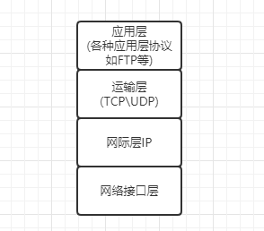
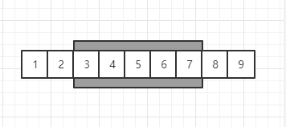
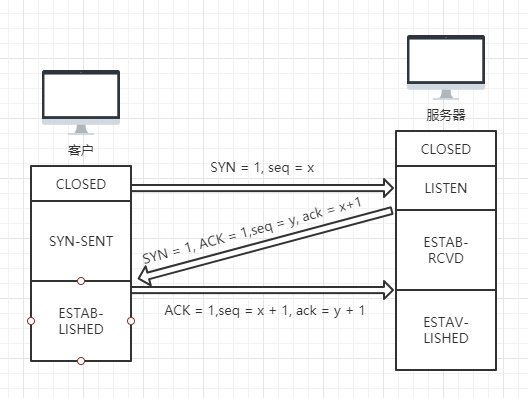
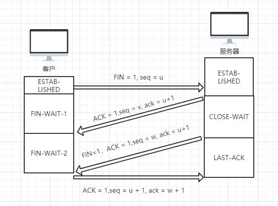

# TCP协议

## 前置知识

### 计算机网络的体系结构
在计算机网络的网络结构有两种体系结构：OSI的七层协议和TCP/IP的四层协议。  
1. OSI的七层协议：概念清楚，理论也比较完整，但它即复杂又不适用。所以导致现在网络中基本都是使用TCP/IP的四层协议。
2. TCP/IP的四层协议的四层分别如图所示：  
   

因为我们日常所使用的 HTTP 协议来源于TCP/IP的应用层，所以本文介绍的TCP/UDP也是属于TCP/IP的四层协议的运输层。  

### 进程之间的通信
从IP层来看，通信的两端是两台主机。IP数据报的首部明确地标志了这两台主机的IP地址。但是其实真正进行通信的实际是在主机的进程，是这台主机中的一个进程和另外一个主机中的进程在交换数据。这也就是为什么网址会是 IP + 端口（端口就是标注了那个进程）  

## TCP协议
TCP是提供面向连接的运输层协议。也就是说在使用TCP协议之前，必须先建立TCP连接。在传送数据完毕后，必须释放已经建立的TCP连接。  

### TCP特点
* 必须先建立连接
* 每一条TCP连接只能有两个端点
* 提供全双工通信
* TCP 提供可靠交付
* 面向字节流

### 连续ARQ协议（滑动窗口协议）
滑动窗口协议是TCP协议的精髓所在。如下图所示：表示发送方维持的发送窗口（接收方也会拥有一个一致的接受窗口），发送窗口的大小为 5，代表着发送方可以一次性发送窗口内的5个数据。  
   
滑动窗口协议规定，发送方没收到一个确认，就把发送窗口向前滑动一个分组（序号）的位置。如上图：发送方已经从 1 滑动到 3 了。

### 累积确认
但在实际使用情况，为了节省网络的使用情况，接收方并不会逐个返回确认，而是采用累积确认法。  

接收方不必对收到的分组逐个发送确认，而是收到几个分组后，对按需到达的最后一个分组发送确认。如上图：接收方会对发送方，发送序号为 3 的确认，表示 3之前的都已经收到了，下一个想收到的数据分组为 3。  

#### 缺点
世上任何东西有优点，那么也会有相应的缺点，累积确认也是。累积确认的缺点在于如果我收到了 4 5 6 这三个序号的数据，但是 3 没有收到，那么发送方依然也要对 3 4 5 6 这四个数据进行重发。

### 超时重传
超时重传就是在发送方在规定的时间内没有收到确认就要重传已发送的报文。  
超时重传难点在于超时的时间设置，而 TCP 则是采用了一种自适应算法。（这里不再做过多的介绍）  

### 流量控制
所谓流量控制就是让发送方的发送速率不要太快，要让接受方来得及接受。  
利用滑动窗口机制可以很方便第在 TCP 连接上实现对发送方的流量控制。接受方在建立连接时或返回确认收到序号时，都可以在TCP首部上填入窗口的大小(rwnd字段)告诉发送方窗口最大值不能超过这个。  

## TCP的拥塞控制
所谓拥塞控制就是防止过多的数据注入到网站中，这样可以使网络的路由器或链路不致与过载。拥塞控制是一个全局性的过程，涉及到所有的主机、所有的路由器，以及与降低网络传输性能有关的所有因素。  

### TCP的拥塞控制方法
拥塞控制也叫基于窗口的拥塞控制，也就是对于滑动窗口协议的窗口大小进行控制。优先权大于流量控制的窗口限制。

#### 慢开始
慢开始思路就是对窗口的大小由小到大逐渐增大。发送方每都到一个队新报文段的确人（重传的不算），就使发送方的拥塞窗口加一。  

为了防止拥塞窗口 cwnd 增长多大引起网络拥塞，还需要设置一个慢开始门限（ssthresh）

当 cwnd = ssthresh时，可以进行拥塞避免或慢开始  
当 cwnd > ssthresh时，进行拥塞避免
当 cwnd <> ssthresh时，进行慢开始

#### 拥塞避免
拥塞避免算法的思路就是让拥塞窗口 cwnd 缓慢的增大，即每经过一个往返时间 RTT 就把发送方的拥塞窗口 cwnd 加一，而不是加倍增长。 

当网络出现拥塞时（出现网络超时），拥塞避免算法会使 ssthresh = cwnd / 2 同时设置 cwnd = 1

#### 快重传
快重传算法是为了让发送方尽早知道发生了个别报文段的丢失进而规定了规则： 
* 接收方需立即发送收到确认
* 如果有丢失，发送上一个收到的确认

#### 快恢复
当发送方知道现在只是丢失个别报文段时，就启动快恢复。  
* ssthresh = cwnd / 2
* cwnd = ssthresh

## TCP的连接管理
建立TCP连接过程主要解决三个问题：   
* 要使每一方都能够确知对方的存在
* 要允许双方协议一些参数（如最大窗口值、时间戳等）
* 能够对运输实体资源（如缓存大小、连接表中的项目等）进行分配

### TCP的三次握手
TCP建立连接的过程叫做握手，握手需要在客户和服务器之间交换三个TCP报文段  
  
第一次握手：   
客户向服务器请求建立连接，首部中的同步位 SYN = 1，同时选择一个初始序号 seq = x  
第二次握手：  
服务器收到请求后，如果同意连接，则向客户发送同意连接。在确认报文段中把 SYN 和 ACK 都置1，确认号是 ack = x + 1，同时也为自己选择一个初始号 seq = y  
第三次握手：  
客户收到确认后，还需要向服务器发送确认。确认报文的 ACK 置1，确认号 ack = y + 1, 而自己的序号 seq = x + 1。

::: tip
总结就是客户端先发送标有SYN的数据包给服务端，服务端受到后返回标有SYN/ACK的数据包，最后发送端在发送一个标有ACK的数据包
:::

### 为什么客户还要发送一次确认呢？
这时因为客户在向服务器发送第一次握手请求建立时，会有一些意外发送，比如网络不好等情况导致请求丢失或延迟到达。但客户是不知道的，所以在一定时间收不到确认则会重新发送。  
所以为了防止已失效的连接请求突然又传送到服务器，重而产生错误（不知道建立连接的是哪一个）。

### TCP的四次挥手
TCP 连接释放过程称为四次挥手  
  
第一次挥手：  
客户向服务器发送释放请求，并停止在发送数据，主动关闭 TCP 连接  
第二次挥手：  
服务器向客户发送同意释放，注意：这里只是客户对服务器的连接释放，也就是服务器还能像客户发送数据，而客户也必须接受。  
第三次挥手：  
服务器向客户发送释放请求  
第四次挥手：  
客户向服务器发送同意释放，这时服务器对客户的连接释放。自持才是真正的释放完毕

### 为什么客户在四次挥手后还需要等待2MSL时间
1. 为了保证客户发送的最后一个ACK报文段能够到达服务器
2. 防止三次握手的“已失效的连接请求报文段”出现在本连接中。

