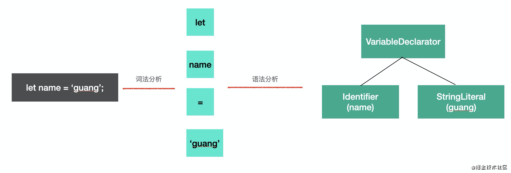

# Babel

## babel 用途

### 转译 esnext、typescript、flow 等到目标环境支持的 js
这个是最常用的功能，用来把代码中的 esnext 的新的语法、typescript和flow 的语法转成基于目标环境支持的语法的实现。并且还可以把目标环境不支持的 api 进行 polyfill。  

babel 7 支持了 preset-env，可以指定 targets 来进行按需转换，转换更加的精准，产物更小。  

### 一些特定用途的代码转换
babel 是一个转译器，暴露了很多 api，用这些 api 可以完成代码到 AST 的 parse，AST 的转换，以及目标代码的生成。

开发者可以用它来来完成一些特定用途的转换，比如函数插桩（函数中自动插入一些代码，例如埋点代码）、自动国际化、default import 转 named import 等。这些都是后面的实战案例。

现在比较流行的小程序转译工具 taro，就是基于 babel 的 api 来实现的。

### 代码的静态分析  
对代码进行 parse 之后，能够进行转换，是因为通过 AST 的结构能够理解代码。理解了代码之后，除了进行转换然后生成目标代码之外，也同样可以用于分析代码的信息，进行一些检查。

* linter 工具就是分析 AST 的结构，对代码规范进行检查。

* api 文档自动生成工具，可以提取源码中的注释，然后生成文档。

* type checker 会根据从 AST 中提取的或者推导的类型信息，对 AST 进行类型是否一致的检查，从而减少运行时因类型导致的错误。

* 压缩混淆工具，这个也是分析代码结构，进行删除死代码、变量名混淆、常量折叠等各种编译优化，生成体积更小、性能更优的代码。

* js 解释器，除了对 AST 进行各种信息的提取和检查以外，我们还可以直接解释执行 AST。 

## babel 的编译流程
babel 是 source to source 的转换，整体编译流程分为三步：
* parse：通过 parser 把源码转成抽象语法树（AST）
* transform：遍历 AST，调用各种 transform 插件对 AST 进行增删改
* generate：把转换后的 AST 打印成目标代码，并生成 sourcemap

  

### 为什么会分为这三步
parse、transform、generate 这 3 步算是一个结论。有没有想过，为什么会分这样的 3 步呢？

源码是一串按照语法格式来组织的字符串，人能够认识，但是计算机并不认识，想让计算机认识就要转成一种数据结构，通过不同的对象来保存不同的数据，并且按照依赖关系组织起来，这种数据结构就是抽象语法树（abstract syntax tree）。之所以叫抽象语法树是因为数据结构中省略掉了一些无具体意义的分隔符比如 ; { } 等。有了 AST，计算机就能理解源码字符串的意思，而理解是能够转换的前提，所以编译的第一步需要把源码 parse 成 AST。

转成 AST 之后就可以通过修改 AST 的方式来修改代码，这一步会遍历 AST 并进行各种增删改，这一步也是 babel 最核心的部分。

经过转换以后的 AST 就是符合要求的代码了，就可以再转回字符串，转回字符串的过程中把之前删掉的一些分隔符再加回来。  

简单总结一下就是：**为了让计算机理解代码需要先对源码字符串进行 parse，生成 AST，把对代码的修改转为对 AST 的增删改，转换完 AST 之后再打印成目标代码字符串。**

### 这三步都做了什么？

#### parse 
parse 阶段的目的是把源码字符串转换成机器能够理解的 AST，这个过程分为词法分析、语法分析。

比如 let name = 'guang'; 这样一段源码，我们要先把它分成一个个不能细分的单词（token），也就是 let, name, =, 'guang'，这个过程是词法分析，按照单词的构成规则来拆分字符串成单词。

之后要把 token 进行递归的组装，生成 AST，这个过程是语法分析，按照不同的语法结构，来把一组单词组合成对象。
 

#### transform
transform 阶段是对 parse 生成的 AST 的处理，会进行 AST 的遍历，遍历的过程中处理到不同的 AST 节点会调用注册的相应的 visitor 函数，visitor 函数里可以对 AST 节点进行增删改，返回新的 AST（可以指定是否继续遍历新生成的 AST）。这样遍历完一遍 AST 之后就完成了对代码的修改。
 

#### generate
generate 阶段会把 AST 打印成目标代码字符串，并且会生成 sourcemap。不同的 AST 对应的不同结构的字符串。比如 IfStatement 就可以打印成 if(test) {} 格式的代码。这样从 AST 根节点进行递归打印，就可以生成目标代码的字符串。

sourcemap 记录了源码到目标代码的转换关系，通过它我们可以找到目标代码中每一个节点对应的源码位置。
 
