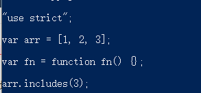
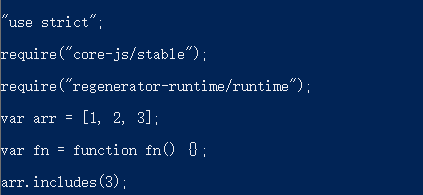
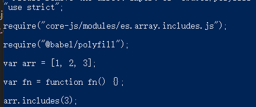

# Babel的Preset
Babel 的预设（preset）可以被看作是一组 Babel 插件和/或 options 配置的可共享模块。也就是 Babel 官方帮你写好的一些功能。  

Babel提供了四个 preset:  
* @babel/preset-env
* @babel/preset-typescript
* @babel/preset-react
* @babel/preset-flow

## @babel/preset-env
@babel/preset-env 主要的功能有两个，分别是：
* 语法转换：语法转换就是把高版本的代码转换成低版本的代码。  
* 添加特性：添加低版本没有的特性。

### 语法转换
语法转换需要用到 @babel/preset-env 。  

@babel/preset-env 的核心包有三个，分别是：browserslist、compat-table 和 electron-to-chromium  

* compat-table: 提供每个特性在不同环境中的支持情况  
* browserslist: 提供了一个从 query （查询表达式） 到对应环境版本的转换。
```js
> 2%
last 2 versions
not dead
```
例如在vue里面指定支持游览器版本的 .browserslist 文件，就是 browserslist 提供的功能  
* electron-to-chromium: 提供了 JS 到 electron 支持。

但是仅仅用 @babel/preset-env 这一个包是不够的。因为前面我们了解到 Babel 的工作机制是先把代码解析成抽象语法树AST，在对 AST 进从操作，最后再变回代码。而这三个转换其实都是在AST树上进行操作。  

所以我们需要 @babel/core 这个包来对代码进行解析等工作。

#### 实践
先新建项目
```js
npm init
```
然后新建 app.js 
```js
let arr = [1, 2, 3]
let fn = () => {}
arr.includes(3)
```
把需要的包进行下载
```js
npm install -D @babel/cli @babel/core
npm install --save-dev @babel/preset-env
```
@babel/cli 的作用是能让我们在命令行进行编译操作 

新建 .babelrc 配置文件
```js
{
  "presets": ["@babel/preset-env"]
}
```
配置运行指令
```js
"babel": "babel app.js",
```
结果：  
  
你会发现 includes 并没有转化啊！  
不急，babel 只是转化了语法， es6 新增的特性还需得用 @babel/polyfill

当然我们还可以添加指定对应的浏览器配置文件（.browserslist）：
```js
> 2%
last 2 versions
not dead
```

### 添加特性
像特性的添加就需要用到  @babel/polyfill 了  

#### 实践
把需要的包进行下载
```js
npm install --save @babel/core
```
corejs 就是 babel 7 所用的 polyfill  
然后在 app.js 引入所需要的文件：
```js
import "core-js/stable";
import "regenerator-runtime/runtime";
```

执行编译后效果如下:  
  
可以看到编译后到效果其实也就是引入 core-js/stable 和 regenerator-runtime/runtime，这两个包里面包含所有的新增特性。  

但我们只用了一个啊，没必要全部添加进来，这样会导致整个项目体积大大的增加。  

所以我们需要修改一下 @babel/preset-env 的配置。  

@babel/preset-env 提供了一个 useBuiltIns 参数，该参数有三个值：
* usage：每个文件引入需要用得到的
* entry: 入口处全部引入
* false: 不引入

所以现在我们需要修改 Babel 的配置：
```js
"presets": [
    ["@babel/preset-env", {
      "useBuiltIns": "usage",
      "corejs": 3
    }]
  ],
```
然后在运行项目的话，我们会发现已经按需引入 includes 的 profill 了   
 


## 源码转换
剩下的三个 preset 属于源码转换，也就是把另一个类型的源码转成 js。例如 ts 转成 js：
* @babel/preset-typescript: TypeScript 转换
* @babel/preset-react: react 的 jsx 转换
* @babel/preset-flow: flow 相关转换

### 实战
我们将上面的 app.js 换成 app.ts。并且修改里面的内容:
```ts
const x: number = 0;
```
安装 @babel/preset-typescript，并且配置 Babel：
```json
{
  "presets": ["@babel/preset-typescript"]
}
```
最后运行指令，我们会发现 const x: number = 0 被转换成 const x = 0 了。