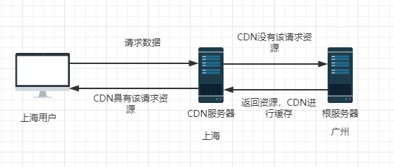

# CDN
CDN（Content Delivery Network），即内容分发网络。

## 什么是 CDN 
当进行 DNS 域名解析时，DNS 会返回一个距离你最近的服务器 IP 地址。例如：你访问的域名是 www.a.com，那么返回的域名可能是 www.a.cname.com之类。也就是让你访问距离你最近的 CDN 服务器，而不是访问根服务器。  

具体流程如下所示(此图省去了 DNS 环节)：  
   

CDN 的核心点有两个：一个是缓存，一个数回源。
### 缓存
既是对根服务器的资源进行缓存到 CDN 服务器。这样用户请求 CDN 服务器时，CDN 能根据缓存的资源直接进行返回，而不需要请求根服务器。

### 回溯
CDN 服务器缓存的内容总有过期的时候。这时用户发起请求，CDN 服务器就会发现该资源没有或者过期，那么 CDN 服务器就会向根服务器发起请求，来更新自己的资源缓存。

## CDN的实际应用案例
由于 CDN 服务器主要以缓存静态资源为主，所以这里我们就以淘宝这种存在大量以图片为主的静态资源作为案例。  

   
我们可以看到对应请求 html 这样的文件，是请求到了 https://www.taobao.com/  

我们在切换看下图片    
  
可以清楚看到它们都是从 CDN 服务器上请求来得。  

不过这里我们可以注意到，淘宝试用了两个不同的域名，这有什么优势呢？  

* 突破请求上限，要知道游览器对于同一组{host,port}请求的请求数一般上限是6个，而部署不同域名，那么就突破了这个上限 
* 如果项目中有 cookie，那么请求的时候一般会携带上 cookie。而部署在不同域名时，请求资源就不会携带上 cookie 了。

 ## 补充

 ### 为什么有了游览器缓存还需要 CDN
 首先我们要知道游览器缓存是针对第一次请求之后的请求的。也就是说首次请求时，游览器还是会请求服务器的，如果服务器只有一个或者太远就会造成首次加载过慢的场景。  
 但是有了 CDN 后，首次请求时对自己最近的 CDN 服务器进行请求，加快了响应速度，同时也减缓了根服务器的压力。  

 ### CDN一般缓存什么
CDN 一般都是被用来存放静态资源。
