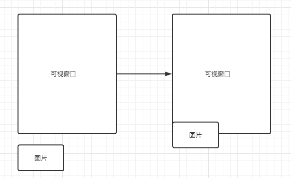

# 图片优化

## 懒加载
图片懒加载的原理就是根据计算图片的位置距离可视窗口的位置，图片距离到达了可视窗口了才进行加载  

  
至于如何实现，这里不再过多介绍。网上有很多教程和现成库可以使用。vue 里也有一个 vue-lazy 库可以使用。
## 预加载
资源预加载是另一个性能优化技术，我们可以使用该技术来预先告知浏览器某些资源可能在将来会被使用到。预加载简单来说就是将所有所需的资源提前请求加载到本地，这样后面在需要用到时就直接从缓存取资源。    

同样对实现原理不再介绍。我们可以使用 PreloadJS 库来实现预加载。

## base64
将图片转换成base64编码，然后输出到游览器上也是有效的减少对服务器的一个方法。不过该方法只适合 1 ~ 3 kb 的图片，图片过大的话会造成 base64 编码过于长，反而走向反向优化。  

```html

```
至于如何转换成base64，网上有很多网站提供了该功能。

## 精灵图
上面是优化 1 ~ 3 kb 的图片，那么其它几kb 甚至几十kb的图片如何优化呢？   

这里就轮到精灵图上场了。精灵图的原理就是把多张小图片合成一张大的图片。然后我们可以根据需要选择展示大图片的某部分。  


但是 src 不能让我们选择一部分显示出来啊。所以这里就需要用到 CSS 的背景属性 background
```css
background: url(bgimage.gif) no-repeat 20px 20px;
```
按顺序下来分时使用到的是：  
* background-image
* background-repeat
* background-position


