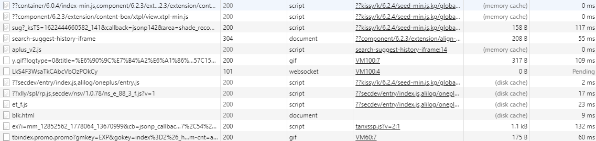
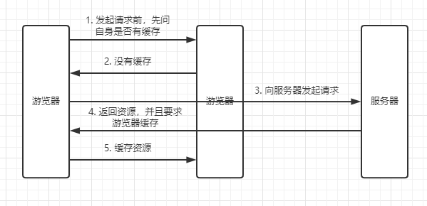
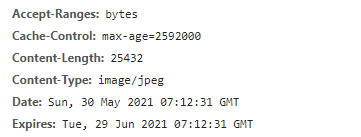
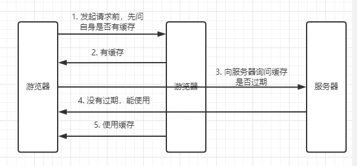

# HTTP缓存

HTTP缓存分为两种：强缓存和协商缓存  

两者都是利用HTTP头部字段信息进行控制

<!-- 游览器缓存机制有四个方面，它们按照获取资源时请求的优先级依次排列如下：
1. Memory Cache
2. Service Worker Cache
3. HTTP Cache
4. Push Cache

这些信息能在控制台中查看，如图下：（前提是配置了缓存）  
  
注意到其中 szie 的描写，标注出了文件对应的缓存模式。 

* 200 from memory cache  
对标 Memory Cache 类型，表示不访问服务器，直接从内存中读取缓存。因为缓存的资源保存在内存中，所以读取速度较快，但是关闭进程后，缓存资源也会随之销毁，一般来说，系统不会给内存分配较大的容量，因此内存缓存一般用于存储较小文件。同时内存缓存在有时效性要求的场景下也很有用（比如浏览器的隐私模式）。  
* 200 from disk cache  
一般由from memory cache 转换而来。表示不访问服务器，直接从硬盘中读取缓存。与内存相比，硬盘的读取速度相对较慢，但硬盘缓存持续的时间更长，关闭进程之后，缓存的资源仍然存在。由于硬盘的容量较大，因此一般用于存储大文件。  
* 200 from prefetch cache  
 在 preload 或 prefetch 的资源加载时，两者也是均存储在 http cache，当资源加载完成后，如果资源是可以被缓存的，那么其被存储在 http cache 中等待后续使用；如果资源不可被缓存，那么其在被使用前均存储在 memory cache。  
* from ServiceWorker  
对标 Service Worker Cache 类型   -->


## 强缓存
游览器在加载资源时，会首先判断是否命中强缓存，命中则不再向服务器发送请求，直接从缓存中获取数据。具体流程如下图：  

  
如果命中缓存则直接在第二步时返回缓存的资源，则不会再向下走。

### expires
实现强缓存有两种方式，这两种方式都是在相应头中添加对应的字段来达到缓存的控制。在过去实现强缓存中，我们一直使用的是expires。   

  
当服务器返回响应时，在响应头中将过期时间写入 expires 字段。其时间是截止时间戳。  
```
Expires: Tue, 29 Jun 2021 07:12:31 GMT
```
<!-- 而cache-control则是根据现在时间和过期时间计算出来的时间差，单位为 秒。
```
Cache-Control: max-age=2592000
```
这里为什么会强调 cache-control，因为 cache-control 就是即将讲的实现强缓存第二个方式。   -->

从上面可以看到 expires 是一个时间戳的值，如果接下来我们再次试图请求该资源时，浏览器会进行图下步骤：  
1. 先把本地时间和 expires 的时间戳进行比较。  
2. 如果本地时间小于 expires 的时间，那么直接从缓存中获取数据
3. 如果本地时间大于 expires 的时间，那么则发送该请求到服务器获取资源。  

### Cache-Control 
在 Cache-Control 中，我们可以通过设置 max-age 字段来实现强缓存。与 expires 不同的是， Cache-Control 设置的是相对的时间长度，即缓存存活时间，而不是截止时间。    
```
Cache-Control: max-age=2592000
```
就像上面的存活时间差不多是 30 天。  

#### 其它值
Cacge-Control 的值肯定不止 max-age 一个。 还有下面几个比较常用的设置值：

* public: 可以被所有的用户缓存，包括终端用户和 CDN 等中间代理服务器。
* private: 只能被终端用户的浏览器缓存，不允许 CDN 等中继缓存服务器对其缓存。
* no-cache: 开启协商缓存，每次请求资源时，会先发个请求到服务器询问该资源是否过期。
* no-store: 禁止使用缓存，每一次都要重新请求数据。
* s-maxage：设置代理服务器缓存时间。在代理服务器上设置后，代理服务器会直接忽略 max-age 和 expires。

::: tip
* 当 expires 和 cache-control 一起是，优先使用 cache-control
* 在没有设置 public时，但有明确缓存信息（例如 max-age）时，也是可以多方缓存的。
* max-age相比expires解决的是客户端和服务器直接时差不一致而导致缓存时间不一致的问题。
:::


## 协商缓存
当强缓存没有命中的时候，游览器就会与服务器进行协商缓存。其过程如下图：  
   
从图中我们可以看出，协商缓存和强缓存最大的区别在于，客户端不能自己判断资源有没有过期，而是发请求对服务器进行提问，然后再根据服务器返回的结果来决定是使用缓存还是重新发起请求。  

::: tip
当服务器返回状态码时 304 则说明缓存资源没有过期，能有使用。否则服务器直接返回最新的资源，状态码为 200
:::

### Last-Modify/If-Modify-Since
Last-Modify 是一个时间戳，如果我们启用了协商缓存，它会在首次响应中在响应头上返回  
```
Last-Modified: Tue, 25 May 2021 06:19:52 GMT
```

当浏览器再次请求该资源时，request 的请求头中会包含 If-Modify-Since，该值为缓存之前返回的 Last-Modify。
```
If-Modified-Since: Tue, 25 May 2021 06:19:52 GMT
```
服务器收到 If-Modify-Since 后，根据资源的最后修改时间判断是否命中缓存。

如果命中缓存，则返回 304，并且不会返回资源内容，并且不会返回 Last-Modify。  

::: tip
缺点：
* 如果我编辑了文件，但文件内容并没有修改。服务器也会把它当做新资源，进而引发重新请求。
* If-Modify-Since 检查最小时间单位为秒，要是资源在 1 秒内被修改完成，那么不会引发重新请求。
:::

### ETag/If-None-Match
Etag 正是为了解决 If-Modify-Since 的 bug 而产生的。Etag 是由服务器为每个资源生成的唯一的标识字符串，这个标识字符串是基于文件内容编码的，只要文件内容不同，它们对应的 Etag 就是不同的，反之亦然。因此 Etag 能够精准地感知文件的变化。  

Etag 和 Last-Modified 过程类似，当首次请求时，响应头里面会带回一个 Etag 字段。 
```
ETag: W/"xxxxxxxx"
```

再次请求时，请求头会携带上 Etag，让服务器做对比。  
```
If-None-Match: W/"xxxxxxxx"
```

服务器返回 304 Not Modified 的响应时，由于 ETag 重新生成过，response header 中还会把这个 ETag 返回，即使这个 ETag 跟之前的没有变化。

::: tip
* ETag 的优先级高于 Last-Modify
* 当强缓存失效后，就会自动走协商缓存。可以说其实协商缓存就是强缓存的一个补充。
:::

## 启发式缓存策略
游览器的默认缓存方式，当服务器没有返回明确的缓存策略时，客户端就会会采取启发式缓存策略。  
**注意，只有在服务端没有返回明确的缓存策略时才会激活启发式缓存策略。**

::: tip

启发式缓存策略会根据其它的首部信息来计算一个过期时间，其他的首部通常是 Date 和 Last-Modified 。缓存有效期一般取两者差值的 10% 。
:::


## 完整的请求流程


<!-- ## 补充

### 如何在项目中使用缓存
由于缓存都是在响应头中配置，所以基本都是在服务端中配置，例如 nginx。  

#### nginx 配置
配置 expires
```js
location /js/ {
    root C:\project\cbdist; // 你的文件存放路径
    expires 30s;
}
```
配置 Cache-Control
```js
location /js/ {
    root C:\project\cbdist; // 你的文件存放路径
    add_header Cache-Control max-age=30;
}
``` -->
