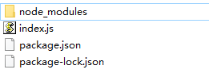

# 初识配置
跟上一节一样创建一新的 webpack 项目，结构如下：  


index.js内容如下：
```js
console.log(123)
```
## Entry 入口
entry 属性的作用就是告诉 webpack 我们的项目文件入口位置在哪里

现在让我们在根目录在新建一个 webpack 配置文件
```js
module.exports = {
    entry: './index.js'
};
```
这里配置的是入口文件为 index.js(因为我们所有其它文件都在index.js里面引入使用，所以webpack就能根据这一个文件能查找到我们使用的所有文件，然后构建依赖图)

## Output 出口
output 属性告诉 webpack 在哪里输出它所创建的 bundle，以及如何命名这些文件。  

添加出口配置
```js
const path = require('path');
module.exports = {
    entry: './index.js',
    output: {
        path: path.resolve(__dirname, 'dist'),
        filename: 'my-first-webpack.bundle.js',
    },
};
```
出口文件也就是配置打包后的文件，path配置打包后放在那里的路径，
filename 是打包后的JS文件命名。  

为了方便打包，我们再在 package.josn 配置下的 scripts 添加一条打包指令
```json
"scripts": {
    "test": "echo \"Error: no test specified\" && exit 1",
    "build": "webpack"
}
```

然后运行打包指令：npm run build  
这时webpack就会根据我们的配置去寻找入口文件index.js然后打包。

## chunk
在打包过程中，首先会进行模块合并。而模块合并成的文件就程之为 chunk。chunk合并成 chunk 组。那么如果通过以上来描述一个入口起点：在其内部，会创建一个只有一个 chunk 的 chunk 组。  
例如：
```js
module.exports = {
    entry: './index.js'
};
```
这会创建一个名为 main 的 chunk 组。此 chunk 组包含 ./index.js 模块。如果index.js里面有新引入的模块，那么新模块也会被添加到此 chunk 中。

记住chunk不是boudle，boudle是chunk输出之后的文件。  

chunk有两种形式：
* initial(初始化)：是入口起点的main chunk。此 chunk 包含入口起点指定的所有模块及其依赖项。
* non-initial 是可以延迟加载的块。可能会出现在使用 动态导入(dynamic imports)或者 SplitChunksPlugin 时。

## mode
配置 webpack 的模式，有三个值：  
* development 开发模式，会将 DefinePlugin 中 process.env.NODE_ENV 的值设置为 development。为模块和 chunk 启用有效的名。
* production 生产模式，会将 DefinePlugin 中 process.env.NODE_ENV 的值设置为 production。为模块和 chunk 启用确定性的混淆名称
* none 不使用任何默认优化选项

如果没有设置，默认为 production。

::: tip
至于 loader 和 plugin 会在下面分开介绍并且简单的使用。
:::


## 配置多入口多出口

### 多个入口
配置多个入口其实很简单，因为entry可以传入一个对象用来做配置。  

```js
module.exports = {
  entry: {
    index: './index.js',
    main: './main.js'
  },
  output: {
    filename: '[name].js',  // 使用 占位符 来确保每个文件具有唯一的名称
    path: __dirname + '/dist',
  },
  plugins: [new HtmlWebpackPlugin()],
}
```
这样两个入口文件 index 和 main 都被独立打包成两个 js 文件，并且都引入进 html。

### 多个出口
上面我面多入口已经完成了，但是打包后都插入到默认的index.html当中了，只有这一个出口，下面看如何制造多个出口。 

```js
module.exports = {
  entry: {
    index: './index.js',
  },
  plugins: [
    new HtmlWebpackPlugin({
      template: './index.html',
      filename:"index.html"
    }),
    new HtmlWebpackPlugin({
      template: './main.html',
      filename:"main.html"
    })
  ]
}
```