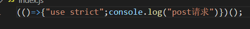
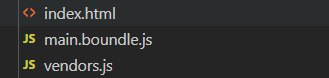
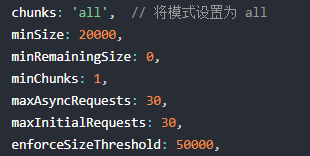
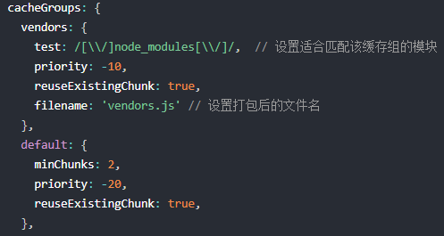
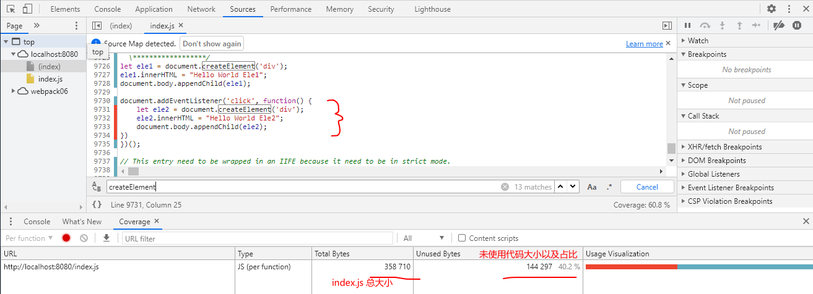
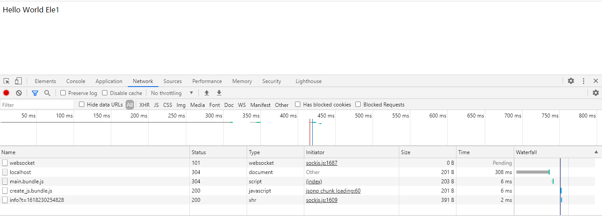

# JS优化
以下都是基于 webpack5 的使用

## 去除无用代码 

### Tree-Shaking
通过我们AST树主干，也就是入口文件。去查找所有的枝干，把所有没用到的枝干去除掉。在编程中也就是在代码中把 Dead Code给去除掉。

### Dead Code  
* 代码不会被执行，不可到达
* 代码执行的结果不会被用到
* 代码只会影响死变量（只写不读）

### Tree-Shanking的限制
Tree-Shanking 依赖于 ES6 模块语法的静态结构特性，例如 import 和 export。  
也就是说想要使用 tree-shanking，必须得使用 import 和 export 来导入和输出。这是因为
ES6 模块依赖关系是确定的，和运行时的状态无关，可以进行可靠的静态分析，这是 tree-shanking 的基础。

### Tree-Shaking的使用

在 webpack.config.js 中的配置
```js
optimization: {
    usedExports: true,
}
```

在package.json 添加 sideEffects 配置
```json
{
  "name": "webpack09",
  "sideEffects": false,
}
```
该配置是为了识别一些不需要进行 tree-shaking 的文件。例如 css scss 或者指定的 js等。  

::: tip
false: 全部都识别。  
true: 自动识别。  
数组: 指定不需要进行 tree-shaking 的文件 
:::

如果我们入口文件引入
```js
import { post } from './http.js';
post()
```
http
```js
function post() {
  console.log('post请求')
}
function get() {
  console.log('get请求')
}
export { post, get}
```
那么打包后的js文件里面，就会只有 post 这个方法。  
   

::: tip
在生产模式下，即使不配置也会默认开启使用
:::

## 压缩混淆 

### UglifyjsWebpackPlugin
本节将会介绍 UglifyjsWebpackPlugin，UglifyjsWebpackPlugin 将会根据 uglify-js 来管理 JS。  

什么是 [uglify-js](https://github.com/mishoo/UglifyJS) ?  

### UglifyjsWebpackPlugin的使用

首先需要安装该插件
```
npm install uglifyjs-webpack-plugin --save-dev
```

然后在 webpack.config.js
```js
const UglifyJsPlugin = require('uglifyjs-webpack-plugin');

module.exports = {
  optimization: {
    minimizer: [new UglifyJsPlugin()],
  },
};
```

## JS分割
经过上面的学习，我们会发现我们打包的时候，所有的 JS 代码都打包进了一个 JS 文件（也就是出口文件）。全部打包进一个文件会给我们带来一些问题。  
1. 全部 JS 代码压缩到一个文件，导致该文件过大，加载时间变长
2. 业务代码和模块代码(也就是 node_modules 等)没分开缓存，导致每次加载都得重新加载不会经常改变的模块代码。  

### SplitChunksPlugin
使用 SplitChunksPlugin 插件进行 JS 分割。在 webpack5 里已经集成到 webpack 了，所以不必再安装。

### 配置讲解
1. chunks 配置分割模式，其值为 all, async 和 initial，分别意思是 全部，异步和初始化代码块。默认为 async
2. minSize 配置最小分割大小要求，单位为字节
3. maxSize 配置最大的限度，单位为字节（一般情况下，使用minSize就足够了）
4. minRemainingSize 确保拆分后剩余的最小 chunk 体积超过限制来避免大小为零的模块，默认值为 minSize 的值
5. minChunks 拆分的最小使用要求，如果为 1，那么只要该模块使用一次就会拆分。
6. cacheGroups 缓存组是将符合 SplitChunksPlugin 要求的模块代码，按需求分开装在不同的 JS。
7. reuseExistingChunk 缓存组下的配置，设定为 true 的话，就会避免重复导入进分割。
8. maxInitialRequests 最⼤初始化请求数，⼊⼝⽂件同步请求，默认3

### 默认配置
```js
// webpack.config.js
module.exports = {
  //...
  optimization: {
    splitChunks: {
      chunks: 'async',
      minSize: 20000,
      minRemainingSize: 0,
      minChunks: 1,
      maxAsyncRequests: 30,
      maxInitialRequests: 30,
      enforceSizeThreshold: 50000,
      cacheGroups: {
        defaultVendors: {
          test: /[\\/]node_modules[\\/]/,
          priority: -10,
          reuseExistingChunk: true,
        },
        default: {
          minChunks: 2,
          priority: -20,
          reuseExistingChunk: true,
        },
      },
    },
  },
};
```

### 实践
在项目中使用 lodash，lodash需要自行 npm 下载
```js
import _ from 'lodash'
let arr1 = [1, 2, 3]
console.log(_.concat(arr1, [4, 5, 6]))
```

配置webpack.config.js
```js
module.exports = {
  optimization: {
    splitChunks: {
      chunks: 'all', // 模式改成 all
      //..
      cacheGroups: {
        defaultVendors: {
          test: /[\\/]node_modules[\\/]/, // 匹配node_modules的文件按这里的规则进行打包
          priority: -10,
          filename: 'vendors.js',  // 同时指定命名为 verdors.js
          reuseExistingChunk: true,
        },
        default: {
          minChunks: 2,
          priority: -20,
          reuseExistingChunk: true,
        },
      },
    },
  },
};
```
打包结果   

  

### 总结分析
最后在来总结下这个分割运行流程  

1. 首先是校验条件，根据条件合不合格再进行下一步  

  

2. 上一步合格的模块将进入 cacheGroups 里面匹配，像我们的 lodash 是输入node_modules 里面的
，所以会和 vendors 里面的匹配规则 test 匹配成功，那么就打包进 vendors 的 JS 文件。（优先度则是根据 priority 的优先级来匹配）  

  

3. 都没匹配上的则进入最后 default 的选项。  

所以如果你想拆分成多几个 JS 文件，那么就需要在 cacheGroups 里根据需求添加多几个匹配选项。

## 思考
为什么 webapck 的 chunks 默认是 async 而不是 all 呢？  

这是因为 webpack 希望的是每次首页加载都能够迅速的加载，而不是首次过后有了缓存加载才迅速。  

### 实验
把我们的 index.js 做如下修改
```js
let ele1 = document.createElement('div');
ele1.innerHTML = "Hello World Ele1";
document.body.appendChild(ele1);

document.addEventListener('click', function() {
    let ele2 = document.createElement('div');
    ele2.innerHTML = "Hello World Ele2";
    document.body.appendChild(ele2);
})
```
webpack 配置如下
```js
const HtmlWebpackPlugin = require('html-webpack-plugin');
const path = require('path');

module.exports = {
    mode: "development",
    entry: './index.js',
    devtool: 'cheap-module-source-map',
    output: {
        path: path.resolve(__dirname, './dist'),
        filename: 'index.js'
    },
    plugins: [
        new HtmlWebpackPlugin({
            template: './index.html'
        }),
    ],
    devServer: {
        contentBase: path.join(__dirname, 'dist')
    }
}
```
这里使用了devServer服务器来运行。开启服务器。  

打开网址按 F12 进入开发者模式，再按Ctrl+Shift+P，再输入「Coverage」，效果图如下：  

  

下面的 Total Bytes 说明了 index.js 文件的大小为 358710 字节  
而 Unused Bytes 则说明了 还有 140473 字节的代码未使用，占总代码的百分之40.2%  

而我们的点击事件就在这其中  
```js
document.addEventListener('click', function() {
  // 未使用代码
    let ele2 = document.createElement('div');
    ele2.innerHTML = "Hello World Ele2";
    document.body.appendChild(ele2);
})
```
所以 webpack 希望我们把这些首次加载使用不到的代码给去掉，换成异步或者懒加载等解决方案    

::: tip
这里本来是不想用 devServer 拉起一个服务器的，因为这样会很麻烦。但是在实践过程中发现
不拉起服务器而直接打开html，谷歌游览器的 Coverage 并不能有效识别出 js 文件。不知道
大家情况会不会跟我一样。。。
:::

### 优化方案 使用 prefetch
prefetch：预获取，也就是让游览器在空闲时间内在加载

1. 先把index.js 拆分
```js
// index.js
let ele1 = document.createElement('div');
ele1.innerHTML = "Hello World Ele1";
document.body.appendChild(ele1);

document.addEventListener('click', async () => {
    const { default: func } = await import(/* webpackPrefetch: true */ './create.js');
    func();
})
```
将点击事件的函数抽取成一个单独的 JS 文件，然后在点击时再一步导入

```js
function createEle() {
    let ele2 = document.createElement('div');
    ele2.innerHTML = "Hello World Ele2";
    document.body.appendChild(ele2);
}

export default createEle
```

效果图如下：

   
我们可以从这里看到，我们明明还没有点击触发点击事件进行异步加载 create.js ，但游览器却帮我们提前加载了。

其原理就是生成 \< link rel="prefetch" href="create.js" \> 并追加到页面头部，指示着浏览器在闲置时间预取 create.js 文件。  

### preload 预加载
当然 webpack 还提供了另一个名为 preload 的模块。  

这两个的区别 webpack 是这样说的：

1. preload chunk 会在父 chunk 加载时，以并行方式开始加载。prefetch chunk 会在父 chunk 加载结束后开始加载。
2. preload chunk 具有中等优先级，并立即下载。prefetch chunk 在浏览器闲置时下载。
3. preload chunk 会在父 chunk 中立即请求，用于当下时刻。prefetch chunk 会用于未来的某个时刻。
4. 浏览器支持程度不同。


