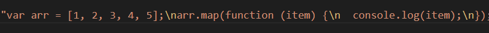

# Babel

## 什么是babel
Babel 是一个 JavaScript 编译器。主要用于将 ECMAScript 2015+ 版本的代码转换为向后兼容的 JavaScript 语法，以便能够运行在当前和旧版本的浏览器或其他环境中。  
例如：
```js
// Babel 转换前
[1, 2, 3].map((n) => n + 1);

// Babel 转换后，箭头函数变成普通函数
[1, 2, 3].map(function(n) {
  return n + 1;
});
```

## webpack中使用 babel
1. npm install --save-dev babel-loader @babel/core
2. 配置webpack
```js
// webpack.config.js
const path = require('path');

module.exports = {
    mode: "development",
    entry: './index.js',
    output: {
        path: path.resolve(__dirname, './dist'),
        filename: 'index.js'
    },
    module: {
        rules: [
            {
                test: /\.m?js$/,
                exclude: /node_modules/,
                use: {
                    loader: "babel-loader",
                    options: {
                        presets: ['@babel/preset-env']
                    }
                }
            }
        ],
    }
}
```
3. npm install @babel/preset-env --save-dev  拥有这个才能实现转换

4. 编写测试文件，在index.js里写上 ES6 语法
```js
// index.js
let arr = [1,2,3,4,5];
arr.map(item => {
    console.log(item)
})
```
5. 配置打包指令
```js
// package.json
"scripts": {
    "build": "webpack"
}
```
6. 运行 webpack 打包，npm run build  
  
可以看到打包后的文件大小为 1.23 KB  

let 和 箭头函数也成功转为 ES5 的语法了。但有时候我们也希望数组的函数map也能转换
为 ES5，因为有时候并不是所有游览器都会支持。  

## polyfill
这时我们就需要用到了 babel 的 polyfill 来解决
1. npm install --save @babel/polyfill
2. 在 index.js 里面引入 @babel/polyfill
```js
import "@babel/polyfill";
let arr = [1,2,3,4,5];
arr.map(item => {
    console.log(item)
})
```
3. 再次运行打包  
你可以看到里面多了很多的代码，并且打包后的体积增加到4百多Kb  


这时不敢想象的，体积以下只多了400倍。这时为什么呢？  

因为我们把没用到的所有转换代码都加进来了，比如 Promise 这些。所以我们还得修改下配置
使其能自动增加我所用到的装换代码。
```js
module: {
    rules: [
        {
            test: /\.m?js$/,
            exclude: /node_modules/,
            use: {
                loader: "babel-loader",
                options: {
                    presets:[ ['@babel/preset-env',{
                        "useBuiltIns": "usage"
                        },]
                    ]
                }
            }
        }
    ],
}
```
编译打包  
  
整个包的体积一下子就缩小到32KB，这可是大大的优化。原来我也能做优化了  

补充：  
1. 如果在打包是有提示你按住core-js，那么你可以根据提示安装（这并不会影响你打包）
2. 安装完成后还需要在 useBuiltIns 下面添加: "corejs": "你的版本"配置
3. 并且打包后，它会再次提醒你把index.js里 import "@babel/polyfill" 给去掉;

## 补充

### target属性
如果你想babel只针对特定游览器或指定版本以上做转换，那么你需要这个target配置。
```json
{
  "targets": "> 0.25%, not dead"
}
// 或者
{
  "targets": {
    "chrome": "58",
    "ie": "11"
  }
}
```

### plugin-transform-runtime
如果你的 babel 是给组件库或UI库中使用，那么就不推荐使用 presets 了，因为它是全局
引入，会污染环境。而 plugin-transform-runtime 则是为您的代码创建一个沙盒环境。
```json
{
  "plugins": ["@babel/plugin-transform-runtime"]
}
```
具体使用方式，推荐官网查看。