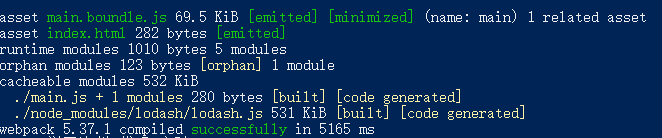
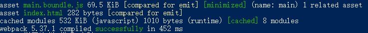

# 缓存
以下都是基于 webpack5  

## 持久化缓存

### webpack4的持久化缓存
* 通过把 loader 的处理结果缓存到本地磁盘，来加速二次编译
* 通过预编译 dll 让 webapck 跳过一些模块的编译，来加速编译

这些方案在一定程度上解决了编译速度慢的问题，但随之而来的是成堆的配置，严重影响了 webapck 的使用体验。  

### webapck5的持久化缓存
在webpack5中提供了内置缓存方案。通过使用 cache 这个对象来实现缓存生成的 webpack 模块和 chunk，来改善构建速度。
cache 的 type 有两个属性:  
* menory：缓存在内存中（当cache设置为true时，同效）
* filesystem: 缓存在磁盘中（当设置为filesystem时，会开发额外配置，请自行到官网查看）

```js
module.exports = {
    ...,
    cache: {
        type: 'filesystem',   //默认为memory，也就是存储到内存
        buildDependencies: {
            config: [__filename],  /* 将你的 config 添加为 buildDependency，以便在改变 config 时获得缓存无效*/ 
        },
        ...,
    },
}
```

运行打包  
  
耗时 5165 ms，并且在 node_modules 下的.cache便是缓存的文件   
再次运行打包  
  
耗时 452 ms，效果明显。  

:::tip
cache 的属性 type 会在开发模式下被默认设置成 memory，而且在生产模式中被禁用，所以如果想要在生产打包时使用缓存需要显式的设置。
:::

## 长久缓存
长久缓存指的是游览器对我们前端文件的缓存。当我们请求的文件名没有变得时候，游览器就会直接使用缓存的文件，否则重新请求加载。  

```js
optimization.moduleIds = 'deterministic'
optimization.chunkIds = 'deterministic'
```

此配置在生产模式下是默认开启的，它的作用是以确定的方式为 module 和 chunk 分配 3-5 位数字 id，相比于 v4 版本的选项 hashed，它会导致更小的文件 bundles。
由于 moduleId 和 chunkId 确定了，构建的文件的 hash 值也会确定，有利于浏览器长效缓存。同时此配置有利于减少文件打包大小。  

在开发模式下，建议使用:
```js
optimization.moduleIds = 'named'
optimization.chunkIds = 'named'
```