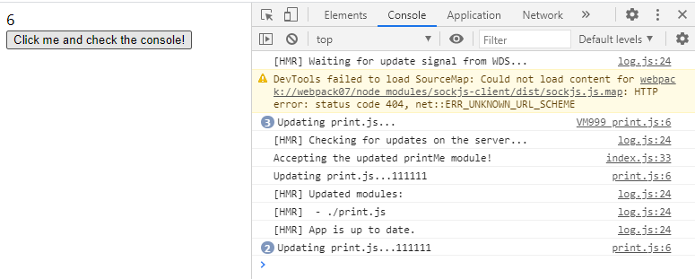

# 开发服务器（devServer）
在使用vue-cli脚手架运行vue项目，打开的却是http://localhost:8080这样的服务器。vue-cli脚手架
是如何实现的呢？答案就是本期的主角 webpack-dev-server  

## 项目配置
按照 plugin 里面配置好基础的项目
```js
//webpack-config.js
const HtmlWebpackPlugin = require('html-webpack-plugin');
const path = require('path');

module.exports = {
  mode: 'development',
  entry: './index.js',
  output: {
    path: path.resolve(__dirname, './dist'),
    filename: 'index.js',
  },
  plugins: [new HtmlWebpackPlugin({
      template: './index.html'
  })],
};
```

## 添加webpack-dev-server
1. 首先下载 webpack-dev-server
2. 在 webpack-config.js 里配置
```js
const HtmlWebpackPlugin = require('html-webpack-plugin');
const path = require('path');

module.exports = {
    mode: "development",
    entry: './index.js',
    output: {
        path: path.resolve(__dirname, './dist'),
        filename: 'index.js'
    },
    plugins: [new HtmlWebpackPlugin({
        template: './index.html'
    })],
    devServer: {
        contentBase: path.join(__dirname, 'dist'),
        port: 8080
    }
}
```
contentBase：告诉服务器内容的来源。  
port：设置服务器端口，默认8080  

3. 在 package.json 配置启动项
```js
{
  "scripts": {
    "serve": "webpack serve"
  },
}
```
4. 接着运行项目 npm run serve


然后只要你修改了入口文件，那么webpack就会自动重新打包编译。

## 模块热替换（HotModuleReplacementPlugin）
在完成上一步后，我们发现虽然我们每次修改代码已经不用手动编译了，但是还需要我们手动刷新游览器。
那么 vue-cli 是如何实现自动刷新的呢？这里就需要用到 HotModuleReplacementPlugin 插件了。  

### 更新 jS 文件
在上面的项目基础上添加一些配置
```js
//webpack.config.js
const HtmlWebpackPlugin = require('html-webpack-plugin');
const webpack = require('webpack');
const path = require('path');

module.exports = {
    mode: "development",
    entry: './index.js',
    output: {
        path: path.resolve(__dirname, './dist'),
        filename: 'index.js'
    },
    plugins: [
        new HtmlWebpackPlugin({
            template: './index.html'
        }),
        new webpack.HotModuleReplacementPlugin({}) // 添加热模块替换插件
    ],
    devServer: {
        contentBase: path.join(__dirname, 'dist'),
        hot: true,  // 启用 webpack 的 Hot Module Replacement 功能
        hotOnly: true  //启用热模块替换，无需页面刷新
    }
}
```

修改index.js
```js
// index.js
import _ from 'lodash';
import printMe from './print.js';

function counter() {
    const element = document.createElement('div');
    element.innerHTML = 1;
    element.onclick = function() {
        element.innerHTML = parseInt(element.innerHTML) + 1
    }
    document.body.appendChild(element)
}

counter();

function component() {
    const btn = document.createElement('button');

    btn.innerHTML = 'Click me and check the console!';
    btn.onclick = printMe;

    return btn;
}
let element = component();
document.body.appendChild(element);

if (module.hot) {
    module.hot.accept('./print.js', function() {
        console.log('Accepting the updated printMe module!');
        printMe();
        document.body.removeChild(element); // 移除之前添加的element
        element = component(); // 重新渲染 "component"，以便更新 click 事件处理函数
        document.body.appendChild(element); // 添加之前添加的element
    })
}

```

print.js
```js
export default function printMe() {
    console.log('Updating print.js...');
}
```

效果图如下  
  

这时我们点击数字，使其增加，然后再点击按钮，使其console出相应的消息
  

最后我们修改print.js，保存后再去点击按钮
```js
export default function printMe() {
    console.log('Updating print.js...111111');
}
```

你会发现在页面没有刷新的情况下，完成了print.js的代码的更新，这就是热模块替换的功能。
  

而vue-cli则是在此基础上进一步自动添加了if (module.hot){ }这个功能。

### 更新 CSS 文件
把css相关loader配置进去
```js
//webpack.config.js
 module: {
    rules: [
      {
        test: /\.css$/,
        use: ['style-loader', 'css-loader'],
      },
    ],
},
```

修改index.js
```js
//修改index.js
import './index.css';

function counter() {
    const element = document.createElement('div');
    element.innerHTML = 1;
    element.setAttribute('id', 'box')
    element.onclick = function() {
        element.innerHTML = parseInt(element.innerHTML) + 1
    }
    document.body.appendChild(element)
}

counter();

```
添加index.css 
```css
#box {
    background: red;
}
```

运行后点击数字子增长  
  

然后回到index.css 修改背景色  
  
会发现，之前增加的树子还在但背景色却变了。而且这里我们并没有像 js 那样有
if (module.hot){ }来替换 css。  
这时因为跟vue-cli脚手架一样，这个功能 css-loader 帮我们做好了。