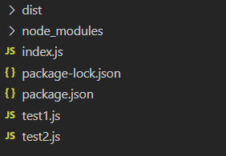

# 什么是Webpack

## 概念
webpack 的核心是用于现代 JavaScript 应用程序的静态模块打包器。 当 webpack 处理您的应用程序时，它会在内部构建一个依赖关系图，该图映射您项目所需的每个模块并生成一个或多个包。  

核心关键词：静态模块打包、构建依赖关系图和生成一个或多个包。

## 静态模块打包
为什么要模块打包呢？要知道node.js 生态中积累了大量的 JavaScript 写的代码，却因为 node.js 端遵循的 CommonJS 模块化规范与浏览器端格格不入，导致代码无法得到复用，这是一个巨大的损失。于是 webpack 要做的就是将这些模块打包成游览器识别的代码。  

## 依赖关系图
那 webpack 如何知道你用了哪些包呢？这就需要用到依赖关系图。  
webpack 会从入口文件开始，递归的构建一个应用程序所需要的模块的依赖树。只要遇到 CommonJS 的 require 或者 ES6 的 import 就会去解析这个依赖，而这个依赖里面可能又用 require 和 import 引用更多依赖。就这样层层套进，最终会生成依赖树。  

## 生成一个或多个包
webpack 可以根据配置来提取生成多个包。这里不做多介绍，之后深入学习后，你就了解到了。  

## 不使用webpack的时候

在不适用webpack的情况下，我们引入JS文件是这样的
```js
// index.html
<script src="index.js"></script>
```
但是这样会有一个很重要的缺点，那就是随着代码越来越多，那么这个index.js就会越来越大。
到时上万几十万行代码看得能让人绝望.  

于是有人就想，那么我们JS代码按模块分开不就好了吗，一个模块一个功能，在总的index里调用。
然后变成这样引入JS。

```js
// index.html
<script src="test1.js"></script>
<script src="index.js"></script>
<script src="test2.js"></script>
```
虽然这样引入的确解决了单个 JS 文件过大的问题，但却产生了新的问题。如何保证依赖执行的顺序正确？
1. 如果 index.js 使用到了 test2.js 的内容就会报错。这时因为JS执行时从上到下的，所以在执行 index.js 的时候，test2.js还没执行，里面的内容也还没有。
2. 页面加载速度变慢，本来页面只需请求一个index.js现在要请求3个JS文件

## 使用webpack

### 思考
根据上面的问题，我们是试想一下能不能用 require 和 import 引入包。像这样：
```js
//index.js
import test1 from 'test1.js'
import test2 from 'test2.js'
```
这样就能解决模块引入顺序问题了，但是这个依赖让谁来做呢？而且游览器也不识别 import 和 require啊。如果有一个人能全包下来做，那我们就舒服了啊！
 
### webpack登场

1. 首先使用 npm init 初始化项目
2. 使用 Node 安装 webpack 和 webpack-cli
3. 然后创建index.js test1.js和 test2.js 代码如下
```js
//index.js
import test1 from './test1.js';
import test2 from './test2.js';

test1();
test2();
// test1.js
function test1() {
    console.log('test1.js')
}
export default test1;
// test2.js
function test2() {
    console.log('test2.js')
}
export default test2;

```

4. 执行编译指令 npx webpack ./index.js

你就会发现编译出了一个 dist 文件夹，其中整合的 js 文件就在其中。  
创建一个 index.heml 导入运行，你就会发现 console 出了 test1.js test2.js  

项目目录结构如下：  


