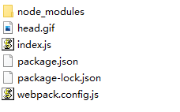
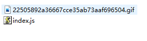

# Loader与Plugin

## Loader
loader 用于对模块的源代码进行转换。

### 概念
webpack 默认只能理解 JavaScript 和 JSON 文件。但是在前端当中还会有 css jpg 等各种文件，而这些文件 webpack 是没办法处理的。这时就需要用到 loader 来扩展 webpack 对于其它文件识别和处理的能力。

### 解析图片Loader
图片的解析我们可以用到两个loader来实现，分别是 file-loader url-loader  
这里只演示 file-loader，如果你有兴趣你可去官网查看自己实现一个url-loader  

1. 创建一个 webpack 项目，目录如下  


并且在index.js引入图片
```js
import img from './head.gif'
```

2. 安装 file-loader （npm install file-loader）

3. 在 webpack.config.js 下配置file-loader
```js
const path = require('path');

module.exports = {
  entry: './index.js',
  output: {
    path: path.resolve(__dirname, 'dist'),
    filename: 'index.js',
  },
  module: {
      rules: [
        { test: /\.(png|jpe?g|gif)$/i, use: 'file-loader' },
      ]
  }
};
```
在rules里写上你的配置  
test：匹配文件的后缀  
use：匹配对了然后使用哪个loader来解析  

4. 运行打包指令  
  

这时我就可以在dist文件夹下看到我们打包出来的图片了  

当然如果我们不想修改图片名称的话，可以这样在file-loader上添加配置
```js
module: {
    rules: [
    { 
        test: /\.(png|jpe?g|gif)$/i, 
        use: [
            {
                loader: 'file-loader',
                options: {
                    name: '[name].[ext]'
                }
            }
        ],
        
    },
    ]
}
```
### 解析CSSLoader
解析CSS需要用到两个 loader，一个是 css-loader，另一个是 style-loader，两个Loader分别
负责不同职责，如下：  
css-loader：会对 @import 和 url() 进行处理，就像 js 解析 import/require() 一样。  
style-loader：把 CSS 插入到 DOM 中

1. 创建一个webpack项目
2. 下载好 css-loader style-loader 并且配置好webpack
```js
const path = require('path');

module.exports = {
  entry: './index.js',
  output: {
    path: path.resolve(__dirname, 'dist'),
    filename: 'index.js',
  },
  module: {
      rules: [
        {
            test: /\.css$/i,
            use: ["style-loader", "css-loader"],
        },
      ]
  }
};
```
3. 在根目录下创建一个 css 文件
```css
body {
    background: #000;
}
```
4. 在index.js引入
```js
import css from './index.css'
```
5. 运行打包，然后找个html导入打包后的 css我们就可以看到效果了

::: tip
当遇到多个 loader 的时候，webpack 默认是从后面的 loader 开始执行。这里也就是先执行 css-loader 再到 style-loader
:::


## Plugin

### 什么是插件
loader 被用于识别并转换某些类型文件的模块，而插件则可以用于执行范围更广的任务。目的在于解决loader无法实现的其他事，从打包优化和压缩，到重新定义环境变量。  

### HtmlWebpackPlugin
之前我们每次打包都会发现，我们的 html 文件需要自己手动创建在 dist 目录下。而熟知 vue 的朋友
会知道 vue 的打包会自动生成一个 html 文件。  

想自动生成 html 就需要用到 HtmlWebpackPlugin 这个插件了  
依旧老规矩创建一个 webpack 项目（不清楚的看第一篇）
```js
//index.js
let body = document.body;
body.style.backgroundColor = "#000";
```
1. 安装 HtmlWebpackPlugin  npm install HtmlWebpackPlugin -D
2. 配置插件
```js
const HtmlWebpackPlugin = require('html-webpack-plugin');
const path = require('path');

module.exports = {
  mode: 'development',
  entry: './index.js',
  output: {
    path: path.resolve(__dirname, './dist'),
    filename: 'index.js',
  },
  plugins: [new HtmlWebpackPlugin()],
};
```
3. 执行打包指令
这时候我们就可以发现 dist 目录下自动生成了一个 html 文件，并且自动帮我们引入了打包后的 js  

然后有的朋友又有一个疑问，vue 打包后的 html 里面有一个 html 文件供我修改，然后打包出来的啊  

别急让我们再来配置一下，给HtmlWebpackPlugin一个对照模板
```js
const HtmlWebpackPlugin = require('html-webpack-plugin');
const path = require('path');

module.exports = {
  mode: 'development',
  entry: './index.js',
  output: {
    path: path.resolve(__dirname, './dist'),
    filename: 'index.js',
  },
  plugins: [new HtmlWebpackPlugin({
      template: './index.html'
  })],
};
```

然后再次执行打包，这次我们就能看到模板里面的内容，被赋值到打包后的 html 里面了

### 常用插件
* HotModuleReplacementPlguin 模块热替换
* clean-webpack-plugin 用于在打包前清理上一次项目生成的 bundle 文件（也就是打包文件）
* mini-css-extract-plugin css分割
* purifycss-webpack 去除多余的 css 代码
* optimize-css-assets-webpack-plugin 减小 css 体积