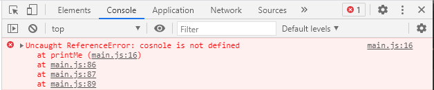
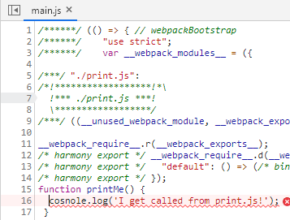
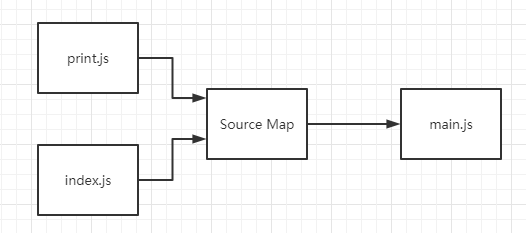
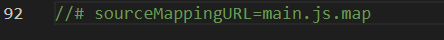
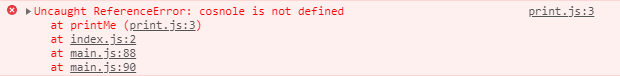
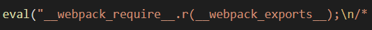
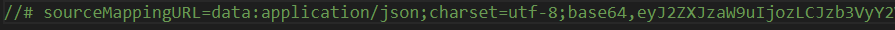

# Source Map

## 前提
我们知道 webpack 对代码压缩会给我们带来几个好处：  
1. 减少体积
2. 多个文件合并，减少 HTTP 请求  

但是除了这些好处，就不会有坏处了吗？我们用代码来实验一下  

index.js
```js
import print from './print'
print()
```
print.js
```js
export default function printMe() {
  // 这里将console写错了
  cosnole.log('I get called from print.js!');
}
```
webpack.config.js
```js
const HtmlWebpackPlugin = require('html-webpack-plugin');

module.exports = {
  mode: 'development',
  entry: './index.js',
  devtool: false, // webpakc 默认会使用Source Map，所以这里要吧它关闭
  plugins: [
    new HtmlWebpackPlugin()
  ]
}
```
然后我们进行打包，然后打开页面。   
  
我们可以看到这个报错提示是在main.js的16行，再次点击进去 
   
点过去后发现竟然真的是跳到打包后main.js的16行，要清楚我们这个语句是写在print.js里面的。  
现在代码量还少，所以我们还能迅速判断是哪里错误。但是要是以后代码量多了起来，再加上框架的源码，那到时候
真的就鬼知道哪里报错。


## 什么是 Source Map
Source Map的作用就如同它的英文名字翻译，源代码映射。由Source Map 创建一个
映射信息文件，里面存储着位置信息来对应打包后的文件。如果有报错，那么main.js就能根据映射文件
找到代码原来文件的所在位置。  


## webpack 里面的 Source Map
webpack 里面的 Source Map 配置组合主要由这五个组成：  

* source-map：产生 .map 文件（配合 eval 或者 inline 使用的时候，不会生成 source map 文件）
* eval：使用 eval 包裹块代码，将source map 内容和业务代码一同放进eval。（执行效率高）
* cheap：只生成行信息（默认会精确到哪一行和那一列）从而较少开支和体积
* inline：将 .map 作为 DataURI 嵌入，不会再生成一个 .map 文件
* module：不仅映射业务代码，还映射 loader 等代码

更多详细组合建议到官网详细看一遍[webpack](https://webpack.docschina.org/configuration/devtool/)

### source-map
使用 source-map 模式。
```js
const HtmlWebpackPlugin = require('html-webpack-plugin');

module.exports = {
  mode: 'development',
  entry: './index.js',
  devtool: 'source-map',
  plugins: [
    new HtmlWebpackPlugin()
  ]
}
```
打包后会生成 main.js.map 文件，并且在 main.js 最下面会标注引入  
  
打开页面，报错也会标注到 print.js 的第几行
   
点击进去也能标注到第几列，不过本文例子也就是第一列，所以看不出区别

###  cheap-source-map
根据上面的配置可以知道，这个只精准到行数而没有列数。与上面 source-map 类似，所以不再演示。

### eval-source-map
使用 eval-source-map 模式。
```js
const HtmlWebpackPlugin = require('html-webpack-plugin');

module.exports = {
  mode: 'development',
  entry: './index.js',
  devtool: 'eval-source-map',
  plugins: [
    new HtmlWebpackPlugin()
  ]
}
```
eval-source-map 与 source-map 的区别在于：代码与source map一同放进 main.js 的 eval里面
  
由于都被压缩在一行而导致太长，所以详细情况请自行操作查看。

### inline-source-map
使用 inline-source-map 模式。
```js
const HtmlWebpackPlugin = require('html-webpack-plugin');

module.exports = {
  mode: 'development',
  entry: './index.js',
  devtool: 'inline-source-map',
  plugins: [
    new HtmlWebpackPlugin()
  ]
}
```
与 eval-source-map 和 source-map 不同在点在其映射信息放在 main.js 的最后一行，source map 是引入映射文件。
 

### cheap-module-source-map
根据上面的配置可以知道，这个只精准到行数而没有列数，并且 loader等映射也会加入。与上面 source-map 类似，所以不再演示。

## 总结
从上面可以看出，即使配置模式再多，那也是围绕着那五个基本信息来组合。  

但如果你想进行更加细粒度的配置，可以根据官方的建议使用 SourceMapDevToolPlugin 插件进行配置。这个
插件不能与 devtool 共同使用，因为 devtool 也是使用它。

在实际中使用的情况：  
开发环境个人建议使用：eval-cheap-module-source-map。  
生产环境个人建议使用：false，既不需要，以达到包的最小化。  