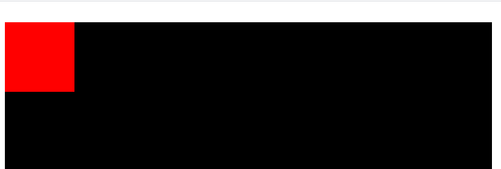
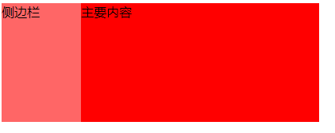

# BFC


## 什么是BFC
BFC（Block Formatting Context）直译为“格式化上下文”。是 W3C CSS 2.1 规范中的一个概念，它决定了元素如何对其内容进行定位，以及与其他元素的关系和相互作用
当涉及到可视化布局的时候，Block Formatting Context提供了一个环境，HTML元素在这个环境中按照一定规则进行布局。

## BFC有什么特性
* 内部的Box会在垂直方向上一个接一个的放置
* 垂直方向的距离由margin决定（属于同一个BFC的两个相邻Box的margin会发生重叠，与方向无关）
* 每个元素的左外边距与包含块的左边界相接触，即使在浮动也是如此
* BFC 的区域不会与float的元素区域重叠
* 计算 BFC 的高度时，浮动子元素也参与计算
* BFC 是一个隔离的独立容器，容器里面的子元素不会影响到外面元素，反之亦然

::: tip
到以上的几条约束，想想我们学习css时的几条规则
* Block元素会扩展到与父元素同宽，所以block元素会垂直排列
* 垂直方向上的两个相邻DIV的margin会重叠，而水平方向不会(此规则并不完全正确)
* 浮动元素会尽量接近往左上方（或右上方）
* 为父元素设置overflow：hidden或浮动父元素，则会包含浮动元素
:::

## 如何触发BFC
1. float的值不能为none
2. overflow的值不能为visible
3. display的值为table-cell, table-caption, inline-block中的任何一个
4. position的值不为relative和static 

::: tip
display：table也认为可以生成BFC，其实这里的主要原因在于Table会默认生成一个匿名的table-cell，正是这个匿名的table-cell生成了BFC
:::

## BFC的作用

### 解决父子共用 margin 问题
在日常页面开发中我们会经常遇到这样一个问题。在给子元素一个margin-top属性后，父元素也会跟着margin-top。像这样  
  
代码如下  
```html
<body>
    <div class="father">
        <div class="child1"></div>
    </div>
</body>
<style>
    .father {
        width: 700px;
        height: 700px;
        background: #000;
    }
    .child1 {
        margin-top: 30px;
        width: 100px;
        height: 100px;
        background: red;
    }
</style>
```
这是为什么呢？其实这就是Block的特性：垂直方向上的两个相邻div的margin会重叠。（上面Tip有说到）。如何解决，这就用到BFC特性的最后一条：BFC 是一个隔离的独立容器，容器里面的子元素不会影响到外面元素  
只要让父元素触发 BFC，那么父元素里面的子元素就不会影响到父元素  
```css
.father {
    width: 700px;
    height: 700px;
    background: #000;
    overflow: hidden;
}
```
效果图如下：
    

### 解决高度塌陷（清楚浮动）
在日常开发中我们使用浮动布局的时候会遇到一个这样的问题，子元素使用浮动布局的时候并不能撑开父元素。像这样：  
   
代码如下：  
```html
<body>
    <div class="father">
        <div class="child1"></div>
    </div>
</body>
<style>
    .father {
        width: 700px;
        background: #000;
    }
    .child1 {
        float: left;
        width: 100px;
        height: 100px;
        background: red;
    }
</style>
```
这时候大家肯定不会讲，那就清楚浮动不就行了吗，关BFC什么事。但是大家有没有注意到，清楚浮动的方法之一中，就有一个给父盒子添加overflow: hidden的方案，其实就是利用了BFC的第五条特性：计算 BFC 的高度时，浮动子元素也参与计算。  
```css
.father {
    width: 700px;
    background: #000;
    overflow: hidden;
}
```
效果如下：  
 

### 防止与浮动元素重叠（自适应两栏布局）
开发中经常会遇到两栏或三栏布局，在不清楚BFC特性前要么两个盒子同时浮动，要么就是弹性布局。那么除此之外我们还可以使用BFC的特性，让其浮动一个盒子即可。
```html
<body>
    <div class="father">
        <div class="aside">侧边栏</div>
        <div class="main">主要内容</div>
    </div>
</body>
<style>
    .father {
        width: 400px;
        background: #000;
        overflow: hidden;
    }
    .aside {
        width: 100px;
        height: 150px;
        float: left;
        background: #f66;
    }
    .main {
        height: 150px;
        background: red;
    }
</style>
```
效果图如下：  
   
这里是用到了BFC的第三条特性：BFC 的区域不会与float的元素区域重叠，右边盒子能自适应变长短。比弹性布局有更好的兼容性。  

本文参考了[史上最全面、最透彻的BFC原理剖析](https://github.com/zuopf769/notebook/blob/master/fe/BFC%E5%8E%9F%E7%90%86%E5%89%96%E6%9E%90/README.md)，并且包含了部分内容。