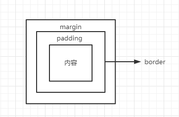

# 盒子模型

## 什么是盒子模型
把HTML中的元素看做是一个矩形的盒子（盛装内容的的容器），每个容器都是由元素内容、内边距（padding）、边框（border）和外边距（margin）组成。如下图所示：  

   

一个盒子属性如此之多，那么一个盒子的宽和高是怎么算的呢？这就得根据各家的规则来。

## 盒子模型的分类

 

### W3C的盒子模型
W3C的盒子模型规定： padding和border不被包含在定义的width和height之内。那么也就是说一个元素的实际宽高就是要加上 padding 和 border 的长度。  
这样上面的盒子计算方式为：  
宽度：50 + 10 + 10 + 1 + 1 = 72  
高度：50 + 20 + 20 + 1 + 1 = 92

:::tip
现在基本默认都是使用W3C的盒子模型
:::

### IE的盒子模型
padding和border被包含在定义的width和height之内。元素的实际宽度就等于设置的width值，即使定义有border和padding也不会改变对象的实际宽度（只会通过减少content的宽高来达到宽高不变效果）。  
这样上面的盒子计算方式为：  
宽度：50 = 50  
高度：50 = 50

:::tip
如果想用IE的盒子模型需设置: box-sizing:border-box;
:::

## 总结
模式没有好坏之分，只能根据自己的需求来使用。