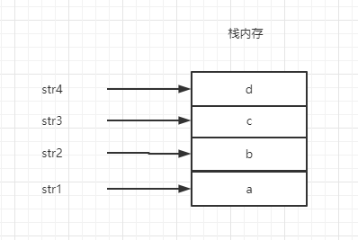
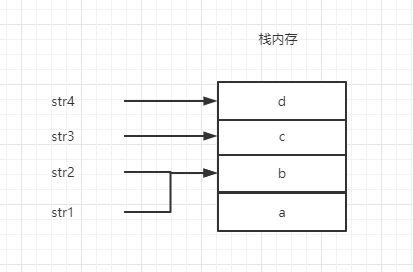
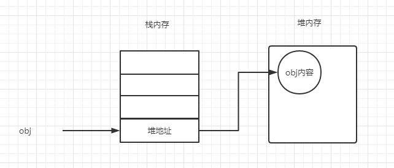
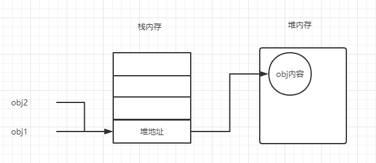

# 数据类型

## 数据类型

ES5：Number、String、Boolean、undefined、Object、null

ES6：Symbol

## 数据类型分类

根据数据类型的特点，数据类型能分成两类：基本类型、引用类型。

基本类型包含：Undefined、Null、Boolean、Number、String、Symbol(ES6)

引用类型：Object

### 基本类型

基本类型的特点：

1. 基本类型存储是直接存储在栈中(stack)
```js
var str1 = 'a';
var str2 = 'b';
var str3 = 'c';
var str4 = 'd';
```
  
所以对变量的取值，是直接去栈获取其相对应的值。  


2. 基本数据类型的值是不可改变的  
当我们给基本类型的变量重新赋值时并不会改变其原来的值。例如修改 str1 = 'b' 详细步骤如下：  
* 去栈中寻找有没有为 'b' 的字符串
* 如果有那么就将 str1 执行该栈的地址，没有则就像栈顶添加一个值为 'b' 的栈，再将 str1 指向该栈。
  
从这里我们可以看到，即使有另一个 str5 = 'b' 跟 str1 共用一个值。然后将 str1 修改也不会影响到 str5 的值。因为它只是改变 str1 的指向而已。  
这就是为什么基本类型共用时，改变一个值，另一个不会受到影响。  
```js
var str1 = 'a'
var str2 = str1
str1 = 'b'
console.log(str1) // b
console.log(str2) // a
```

::: tip
因为在栈的数据大小和生存期必须是确定的，所以栈的寻址速度要快于堆
:::

### 引用类型

引用类型的特点：  
1. 栈中存储的是对象的引用，真实的数据存放在对内存  
  
在基本类型里我们可以得知，当变量改变时，其实是修改变量对于栈的指向。所以当两个变量共用一个栈值时，其实就是共用一个对象。  
  
这就是为什么引用类型在共用时，改一个，另一个的值也会改变。
```js
var obj1 = {
  name: 'zhangsan',
  age: 18
};
var obj2 = obj1;
obj1.name ='lisi';
console.log(obj2.name)  // 'lisi'
```

## 数据类型检测

### typeof

```js
var s = 'zhangsan';
var b = true;
var i = 22;
var u;
var n = null;
var o = new Object();
var arr = [1,2]
var fn = function(){}

// typeof s   String
// typeof b   Boolean
// typeof i   Number
// typeof u   Undefiend
// typeof n   Object
// typeof o   Object
// typeof arr Object
// typeof fn function
```

显然typeof检测基本类型是个得力的助手，但却有两个点不能解决：   
1. 检测null 时返回 obejct 
2. 检测引用类型数据时(包括数组等)，返回object

### instanceof

```js
var s = 'zhangsan';
var b = true;
var i = 22;
var u;
var n = null;
var o = new Object();
var arr = [1,2]

// s instanceof String  false
// b instanceof Boolean  false
// i instanceof Number  false
// u instanceof undefined 报错
// n instanceof Object  false
// o instanceof Object  true
// arr instanceof Array  true
// arr instanceof Object  true
```
显然instanceof只能检测引用类型,对基本类型无效。并且arr instanceof Object也为true。这是因为instanceof是根据它的原型链上来找的，而Array属于Object。所以结果为true。

### constructor

```js
var s = 'zhangsan';
var b = true;
var i = 22;
var u;
var n = null;
var o = new Object();
var arr = [1,2]

// s.constructor String
// b.constructor Boolean
// i.constructor Number
// u.constructor 报错
// n.constructor 报错
// o.constructor Object
// arr.constructor Array
```

constructor和instanceof相识，都是从原型上寻找。不过constrctor只是找当前实例对象的父级prototype的constrctor的属性。
因此修改实例对象的__proto__的constrctor（或者实例对象父级的prototype的constrctor）属性可以修改返回的数据类型。

```js
var arr = new Array(1, 2)

// console.log(arr.constructor) Array

arr.__proto__ = new Object()

// console.log(arr.constructor) Object
```

### Object.prototype.toString.call()
当 toString 方法被调用的时候，下面的步骤会被执行：

1. 如果 this 值是 undefined，就返回 [object Undefined]

2. 如果 this 的值是 null，就返回 [object Null]

3. 让 O 成为 ToObject(this) 的结果

4. 让 class 成为 O 的内部属性 [[Class]] 的值

5. 返回三个字符串"[object ", class, 以及 "]"连接后的新字符串.

通过规范，我们至少知道了调用 Object.prototype.toString 会返回一个由 "[object ", class, 以及 "]" 组成的字符串，而 class 是要判断的对象的内部属性。

```js
var s = 'zhangsan';
var b = true;
var i = 22;
var u;
var n = null;
var o = new Object();
var arr = [1,2]
var fn = function(){};
var date = new Date();
var error = new Error();
var reg = /a/g; 

// Object.prototype.toString.call(s) [object String]
// Object.prototype.toString.call(b) [object Boolean]
// Object.prototype.toString.call(i) [object Number]
// Object.prototype.toString.call(u) [object Undefined]
// Object.prototype.toString.call(n) [object Null]
// Object.prototype.toString.call(o) [object Object]
// Object.prototype.toString.call(arr) [object Array]
// Object.prototype.toString.call(fn) [object Function]
// Object.prototype.toString.call(date ) [object Date]
// Object.prototype.toString.call(error) [object Error]
// Object.prototype.toString.call(reg) [object RegExp]
```

Object.prototype.toStrong.call() 是检测数据类型最全面和准确的方法，其原理是修改Object中的this指向，让其返回我们需要的this指向。

```js
var arr = new Array(1, 2)

// console.log(arr.constructor) Array

arr.__proto__ = new Object()

// console.log(arr.constructor) Object
// console.log(Object.prototype.toString.call(arr)) Array
```

## 封装一个type API
设想：

写一个 type 函数能检测各种类型的值，如果是基本类型，就使用 typeof，引用类型就使用 toString。此外鉴于 typeof 的结果是小写，我也希望所有的结果都是小写。

考虑到实际情况下并不会检测 Math 和 JSON，所以去掉这两个类型的检测。

我们来写一版代码：
```js
var class2Type = {};

"Boolean Number String Function Array Date RegExp Object Error Null Undefined".split(" ").map(function(item, index){
   class2Type["[object " + item + "]"] = item.toLowerCase();
})

function type(obj){
  return typeof obj === "object" || typeof obj === "function" ?
  class2Type[Object.prototype.toString.call(obj)] || "object" : typeof obj;
}
```

### 数组
jQuery 判断数组类型，旧版本是通过判断 Array.isArray 方法是否存在，如果存在就使用该方法，不存在就使用 type 函数。
```js
var isArray = Array.isArray || function( obj ) {
    return type(obj) === "array";
}
```
但是在 jQuery v3.0 中已经完全采用了 Array.isArray。

### window对象
Window 对象作为客户端 JavaScript 的全局对象，它有一个 window 属性指向自身。
```js
function isWindow( obj ) {
    return obj != null && obj === obj.window;
}
```

### isElement
isElement 判断是不是 DOM 元素。
```js
isElement = function(obj) {
    return !!(obj && obj.nodeType === 1);
};
```