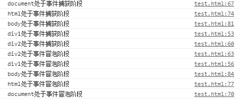
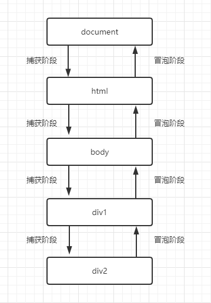

## 什么是事件流
在HTML中点击了某个DOM，那么HTML是如何识别点击了那个DOM。其中就是通过DOM事件流  

DOM事件流包括三个阶段：
1. 捕获阶段
2. 目标阶段
3. 冒泡阶段

## 代码演示
```js
<!DOCTYPE html>
<html lang="en">
<head>
    <meta charset="UTF-8">
    <meta name="viewport" content="width=device-width, initial-scale=1.0">
    <title>Document</title>
</head>
<body>
    <div class="div1" style="width: 400px;height: 400px;">
        <div class="div2" style="width: 200px;height: 200px;"></div>
    </div>
</body>
</html>
<script>
let div1 = document.getElementsByClassName('div1')[0];
let div2 = document.getElementsByClassName('div2')[0];

div1.addEventListener('click',function(){
    console.log('div1处于事件捕获阶段');
}, true); // 为true说明在捕获阶段执行处理程序
div1.addEventListener('click',function(){
    console.log('div1处于事件冒泡阶段');
}, false); // 为false说明在捕获阶段执行处理程序

div2.addEventListener('click',function(){
    console.log('div2处于事件捕获阶段');
}, true);
div2.addEventListener('click',function(){
    console.log('div2处于事件冒泡阶段');
}, false);

document.addEventListener('click',function(){
    console.log('document处于事件捕获阶段');
}, true);
document.addEventListener('click',function(){
    console.log('document处于事件冒泡阶段');
}, false);

document.documentElement.addEventListener('click',function(){
    console.log('html处于事件捕获阶段');
}, true);
document.documentElement.addEventListener('click',function(){
    console.log('html处于事件冒泡阶段');
}, false);

document.body.addEventListener('click',function(){
    console.log('body处于事件捕获阶段');
}, true);
document.body.addEventListener('click',function(){
    console.log('body处于事件冒泡阶段');
}, false);
</script>
```

结果：  



从图中可以看出，事件流显示是从捕获阶段开始，而捕获阶段是从根元素document开始向下一层一层得捕获，直到
捕获到点击的目标DOM元素，然后执行冒泡阶段，而冒泡阶段则是从目标DOM元素一层一层地开始向上冒泡，直到
根元素document


## 示意图
