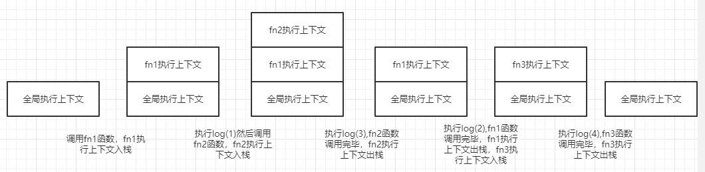

# 执行上下文

## 概念
JS代码在执行前，JS引擎总要做一番准备工作，这份工作其实就是创建对应的执行上下文。

## 执行上下文的类型
JavaScript 中有 3 种执行上下文类型  

### 1. 全局执行上下文
代码运行起来后首先进入全局环境，也就是全局执行上下文。全局上下文会做两件事：创建一个全局的 window 对象，并设置 this 的指向为 window。一个程序中只能有一个全局执行上下文。

### 2. 函数执行上下文
当函数被调用执行时，就会创建一个该函数的执行上下文。

### 3. eval函数执行上下文
执行eval函数时，也会创建一个该函数的执行上下文。但不建议使用。

## 执行上下文栈
执行上下文栈是一种后进先出的栈式数据结构。用来存储执行上下文，栈低是全局执行上下文。每调用一个函数就往栈里添加一个执行上下文。  
```js
let str = 'Hello World'
function fn1(){
  console.log(1)
  fn2()
  console.log(2)
}
function fn2(){ console.log(3) }
function fn3(){ console.log(4) }
fn1()
fn3()
```
该程序的执行上下文栈的变化图： 



## 执行上下文创建执行过程
1. 创建一个新的执行上下文
2. 创建一个新的词法环境（确定作用域链和this指向）
3. 将该执行上下文的变量环境组件和词法环境组件都指向新创建的词法环境
4. 将该执行上下文推入执行上下文栈并成为正在运行的执行上下文
5. 对代码块内的标识符进行实例化及初始化
6. 运行代码
7. 运行完毕后执行上下文出栈

## 思考题
### 变量提升和暂时性死区
变量的提升和暂时性死区原因是在 __执行上下文创建过程__ 的第五步。  

1. 将执行代码块内let、const和class声明的标识符集合记录为lexNames
2. 执行代码块内的 var 和 function 声明的标识符集记录为 varNames
3. 如果 lexNames 内的任何标识符在 varNames 或 lexNames 内出现过，则报错 SyntaxError
::: tip
这就是为什么可以用var或function声明多个同名变量，但是不能用let、const和class声明多个同名变量。
:::
4. 将 varNames 内的 var 声明的标识符实例化并初始化赋值 undefined ，如果有同名标识符则跳过
::: tip
这就是所谓的变量提升，我们用var声明的变量，在声明位置之前访问并不会报错，而是返回undefined
:::
5. 将 lexNames 内的标识符实例化，但并不会进行初始化，在运行至其声明处代码时才会进行初始化，在初始化前访问都会报错
::: tip
这就是我们所说的暂时性死区，let、const和class声明的变量其实也提升了，只不过没有被初始化，初始化之前不可访问。
:::
6. 最后将varNames内的函数声明实例化并初始化赋值对应的函数体，如果有同名函数声明，则前面的都会忽略，只有最后一个声明的函数会被初始化赋值。
::: tip
函数声明会被直接赋值，所以我们在函数声明位置之前也可以调用函数。
:::
