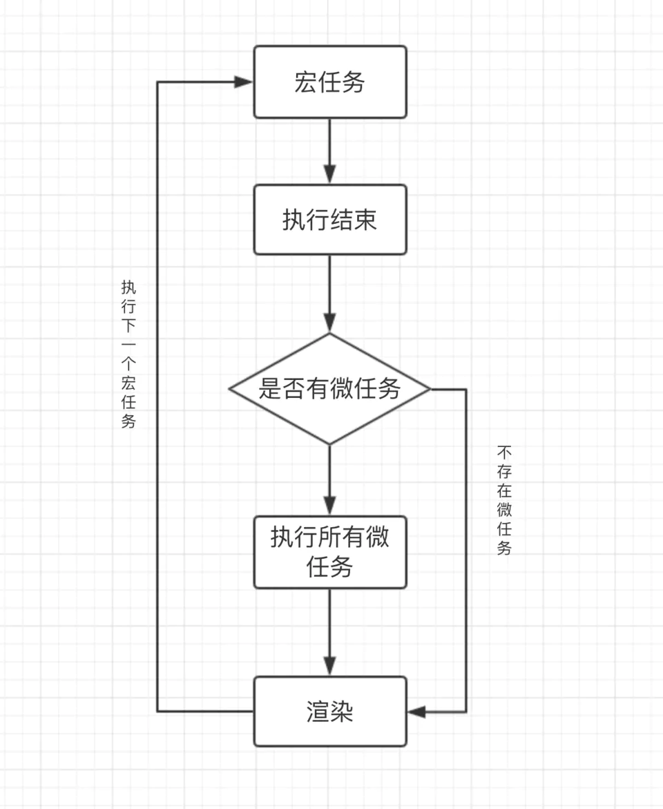

# JS运行机制

::: warning
本节建议先学习进程和线程相关知识后再阅读
:::

## 游览器
游览器是能进行多进程的程序。比如 Chrome，我每打开一个 Tab 页面，其实就是产生一个新的进程。  

### 游览器的进程

#### Browser 进程
* 浏览器的主进程(负责协调、主控)，该进程只有一个
* 负责浏览器界面显示，与用户交互。如前进，后退等
* 负责各个页面的管理，创建和销毁其他进程
* 将渲染(Renderer)进程得到的内存中的Bitmap(位图)，绘制到用户界面上
* 网络资源的管理，下载等

#### 第三方插件进程
* 每种类型的插件对应一个进程，当使用该插件时才创建

#### GPU进程
* 该进程也只有一个，用于3D绘制等等

#### 渲染进程(重点)
* 即通常所说的浏览器内核(Renderer进程，内部是多线程)
* 每个Tab页面都有一个渲染进程，互不影响
* 主要作用为页面渲染，脚本执行，事件处理等

### 渲染进程的线程

#### GUI渲染线程
* 负责渲染浏览器界面，解析HTML，CSS，构建DOM树和RenderObject树，布局和绘制等
    * 解析html代码(HTML代码本质是字符串)转化为浏览器认识的节点，生成DOM树，也就是DOM Tree
    * 解析css，生成CSSOM(CSS规则树)
    * 把DOM Tree 和CSSOM结合，生成Rendering Tree(渲染树)
* 当我们修改了一些元素的颜色或者背景色，页面就会重绘(Repaint)
* 当我们修改元素的尺寸，页面就会回流(Reflow)
* 当页面需要Repaing和Reflow时，GUI线程执行绘制页面
* 回流(Reflow)比重绘(Repaint)的成本要高，我们要尽量避免Reflow和Repaint
* GUI渲染线程与JS引擎线程是互斥的
    * 当JS引擎执行时GUI线程会被挂起(相当于被冻结了)
    * GUI更新会被保存在一个队列中等到JS引擎空闲时立即被执行

#### JS引擎线程
* JS引擎线程就是JS内核，负责处理Javascript脚本程序(例如V8引擎)
* JS引擎线程负责解析Javascript脚本，运行代码
* JS引擎一直等待着任务队列中任务的到来，然后加以处理
    * 浏览器同时只能有一个JS引擎线程在运行JS程序，所以js是单线程运行的
    * 一个Tab页(renderer进程)中无论什么时候都只有一个JS线程在运行JS程序
* GUI渲染线程与JS引擎线程是互斥的，js引擎线程会阻塞GUI渲染线程
    * 就是我们常遇到的JS执行时间过长，造成页面的渲染不连贯，导致页面渲染加载阻塞(就是加载慢)
    * 例如浏览器渲染的时候遇到\<script\>标签，就会停止GUI的渲染，然后js引擎线程开始工作，执行里面的js代码，等js执行完毕，js引擎线程停止工作，GUI继续渲染下面的内容。所以如果js执行时间太长就会造成页面卡顿的情况

#### 事件触发线程
* 属于浏览器而不是JS引擎，用来控制事件循环，并且管理着一个任务队列(task queue)
* 当js执行碰到事件绑定和一些异步操作(如setTimeOut，也可来自浏览器内核的其他线程，如鼠标点击、AJAX异步请求等)，会走事件触发线程将对应的事件添加到对应的线程中(比如定时器操作，便把定时器事件添加到定时器线程)，等异步事件有了结果，便把他们的回调操作添加到任务队列，等待js引擎线程空闲时来处理。
* 当对应的事件符合触发条件被触发时，该线程会把事件添加到待处理队列的队尾，等待JS引擎的处理
* 因为JS是单线程，所以这些待处理队列中的事件都得排队等待JS引擎处理

#### 定时触发器线程
* setInterval与setTimeout所在线程
* 浏览器定时计数器并不是由JavaScript引擎计数的(因为JavaScript引擎是单线程的，如果处于阻塞线程状态就会影响记计时的准确)
* 通过单独线程来计时并触发定时(计时完毕后，添加到事件触发线程的任务队列中，等待JS引擎空闲后执行)，这个线程就是定时触发器线程，也叫定时器线程
* W3C在HTML标准中规定，规定要求setTimeout中低于4ms的时间间隔算为4ms

#### 异步http请求线程
* 在XMLHttpRequest在连接后是通过浏览器新开一个线程请求
* 将检测到状态变更时，如果设置有回调函数，异步线程就产生状态变更事件，将这个回调再放入任务队列中再由JavaScript引擎执行
* 简单说就是当执行到一个http异步请求时，就把异步请求事件添加到异步请求线程，等收到响应(准确来说应该是http状态变化)，再把回调函数添加到任务队列，等待js引擎线程来执行

## 事件循环(Event Loop)
首先要知道，JS分为同步任务和异步任务  

同步任务都在主线程(这里的主线程就是JS引擎线程)上执行，会形成一个执行栈（如果不懂执行栈，可以先看JS基础篇的JS的执行上下文）  

主线程之外，事件触发线程管理着一个任务队列，只要异步任务有了运行结果，就在任务队列之中放一个事件回调  

一旦执行栈中的所有同步任务执行完毕(也就是JS引擎线程空闲了)，系统就会读取任务队列，将可运行的异步任务(任务队列中的事件回调，只要任务队列中有事件回调，就说明可以执行)添加到执行栈中，开始执行
我们来看一段简单的代码  
```js
let setTimeoutCallBack = function() {
  console.log('我是定时器回调');
};
let httpCallback = function() {
  console.log('我是http请求回调');
}

// 同步任务
console.log('我是同步任务1');

// 异步定时任务
setTimeout(setTimeoutCallBack, 1000);

// 异步http请求任务
let xhr = new XMLHttpRequest();
xhr.onload = httpCallback

xhr.open('GET', 'URL', true);
xhr.send();

// 同步任务
console.log('我是同步任务2');
```
执行过程：  
* 首先给 setTimeoutCallBack 和 httpCallback 进行赋值。
* 执行 console.log('我是同步任务1');
* 接着，执行到 setTimeout 时，会移交给定时器线程，通知定时器线程 1s 后将 setTimeoutCallBack 这个回调交给事件触发线程处理，在 1s 后事件触发线程会收到 setTimeoutCallBack 这个回调并把它加入到事件触发线程所管理的任务队列中等待执行
* 接着，执行http请求，会移交给异步http请求线程发送网络请求，请求成功后将 httpCallback 这个回调交由事件触发线程处理，事件触发线程收到 httpCallback 这个回调后把它加入到事件触发线程所管理的任务队列中等待执行
* 再接着执行console.log('我是同步任务2')

至此主线程执行栈中执行完毕，JS引擎线程已经空闲，开始向事件触发线程发起询问，询问事件触发线程的任务队列中是否有需要执行的回调函数，如果有将任务队列中的回调事件加入执行栈中，开始执行回调，如果任务队列中没有回调，JS引擎线程会一直发起询问，直到有为止。  

::: tip
本次代码执行结果如下：
* 我是同步任务1
* 我是同步任务2
* 我是http请求回调 / 我是定时器回调  

最后一步得看请求成功的响应是在 1s 后回到还是 1s 前回到。  
如果请求成功响应比计时器先到达，那么 httpCallback 就比 setTimeoutCallBack 会先进入事件触发线程的任务队列。所以 httpCallback 就会比 setTimeoutCallBack先执行（因为队列是先进先出的执行顺序）。反之亦然
:::

到了这里我们发现，浏览器上的所有线程的工作都很单一且独立，非常符合单一原则  

定时触发线程只管理定时器且只关注定时不关心结果，定时结束就把回调扔给事件触发线程  

异步http请求线程只管理http请求同样不关心结果，请求结束把回调扔给事件触发线程  

事件触发线程只关心异步回调入任务队列  

而我们JS引擎线程只会执行执行栈中的事件，执行栈中的代码执行完毕，就会读取任务队列中的事件并添加到执行栈中继续执行，这样反反复复就是我们所谓的事件循环(Event Loop)

### 图解
  
首先，执行栈开始顺序执行  

判断是否为同步，异步则进入异步线程，最终事件回调给事件触发线程的任务队列等待执行，同步继续执行  

执行栈空，询问任务队列中是否有事件回调  

任务队列中有事件回调则把回调加入执行栈末尾继续从第一步开始执行  

任务队列中没有事件回调则不停发起询问

## 宏任务（macrotask）和微任务（microtask）

### 宏任务（macrotask）
在ECMAScript中，macrotask也被称为task

我们可以将每次执行一次完整的栈（从栈低开始到栈顶再回到栈低）当做是一个宏任务(包括每次从事件队列中获取一个事件回调并放到执行栈中执行)， 每一个宏任务会从头到尾执行完毕，不会执行其他  

由于JS引擎线程和GUI渲染线程是互斥的关系，浏览器为了能够使宏任务和DOM任务有序的进行，会在一个宏任务执行结果后，在下一个宏任务执行前，GUI渲染线程开始工作，对页面进行渲染。如下图所示：  
  

#### 常见的宏任务
* 主代码块
* setTimeout
* setInterval
* setImmediate ()  -Node
* requestAnimationFrame () -浏览器

### 微任务（microtask）

ES6新引入了Promise标准，同时浏览器实现上多了一个microtask微任务概念，在ECMAScript中，microtask也被称为jobs  

我们已经知道宏任务结束后，会执行渲染，然后执行下一个宏任务， 而微任务可以理解成在当前宏任务执行后立即执行的任务  

当一个宏任务执行完，会在渲染前，将执行期间所产生的所有微任务都执行完  
  

#### 常见的微任务  
* process.nextTick () -Node
* Promise.then()
* catch
* finally
* Object.observe
* MutationObserver

## 简单区分宏任务与微任务

看了上述宏任务微任务的解释你可能还不太清楚，没关系，往下看，先记住那些常见的宏微任务即可  

我们通过几个例子来看，这几个例子思路来自[掘金云中君的文章](https://juejin.cn/post/6844903919789801486#heading-4)，通过渲染背景颜色来区分宏任务和微任务，很直观，我觉得很有意思，所以这里也用这种例子  

找一个空白的页面，在console中输入以下代码  

```js
document.body.style = 'background:black';
document.body.style = 'background:red';
document.body.style = 'background:blue';
document.body.style = 'background:pink';
```
   

我们看到上面动图背景直接渲染了粉红色，根据上文里讲浏览器会先执行完一个宏任务，再执行当前执行栈的所有微任务，然后移交GUI渲染，上面四行代码均属于同一次宏任务，全部执行完才会执行渲染，渲染时GUI线程会将所有UI改动优化合并，所以视觉上，只会看到页面变成粉红色  

再接着看  

```js
document.body.style = 'background:blue';
setTimeout(()=>{
    document.body.style = 'background:black'
},200)
```
  

上述代码中，页面会先卡一下蓝色，再变成黑色背景，页面上写的是200毫秒，大家可以把它当成0毫秒，因为0毫秒的话由于浏览器渲染太快，录屏不好捕捉，我又没啥录屏慢放的工具，大家可以自行测试的，结果也是一样，最安全的方法是写一个index.html文件，在这个文件中插入上面的js脚本，然后浏览器打开，谷歌下使用控制台中performance功能查看一帧一帧的加载最为恰当，不过这样录屏不好录所以。。。  
回归正题，之所以会卡一下蓝色，是因为以上代码属于两次宏任务，第一次宏任务执行的代码是将背景变成蓝色，然后触发渲染，将页面变成蓝色，再触发第二次宏任务将背景变成黑色

再来看  
```js
document.body.style = 'background:blue'
console.log(1);
Promise.resolve().then(()=>{
    console.log(2);
    document.body.style = 'background:pink'
});
console.log(3);
```

   

## 微任务宏任务注意点

### 执行顺序
1. 浏览器会先执行一个宏任务和产生一个微任务队列
2. 把该宏任务执行过程中产生的微任务放进微任务队列。
3. 当宏任务执行完成后，才执行微任务
4. 然后再进行渲染，然后再执行下一个宏任务

### 注意点
* 微任务和宏任务不在一个任务队列
* 微任务是如何产生的呢？当执行到script脚本的时候，js引擎会为全局创建一个执行上下文，在该执行上下文中维护了一个微任务队列

### 图解
  

首先执行一个宏任务，执行结束后判断是否存在微任务  

有微任务先执行所有的微任务，再渲染，没有微任务则直接渲染  

然后再接着执行下一个宏任务  

::: tip
为什么会有 先宏任务再微任务 和 先微任务再宏任务 两种说法？  
这关键于有没有把JS第一次解析 \<script\>\</script\> 里面的代码当不当做宏任务。如果当做宏任务那么就是先宏任务再微任务。
如果不当做宏任务，那么就是先微任务再宏任务。  

那JS第一次解析 \<script\>\</script\> 里面的代码 到底算不算宏任务？  
其实是算的，让我们再来看看宏任务的定义 主代码块和一次完整的执行栈，这两个条件都是完全符合的。

所以正确的说法应该是 先宏任务再微任务 或者 微任务在下一个宏任务之前
:::

## 图解完整的Event Loop
   
首先，整体的script(作为第一个宏任务)开始执行的时候，会把所有代码分为同步任务、异步任务两部分  

同步任务会直接进入主线程依次执行  

异步任务会再分为宏任务和微任务  

宏任务进入到Event Table中，并在里面注册回调函数，每当指定的事件完成时，Event Table会将这个函数移到Event Queue中  

微任务也会进入到另一个Event Table中，并在里面注册回调函数，每当指定的事件完成时，Event Table会将这个函数移到Event Queue中  

当主线程内的任务执行完毕，主线程为空时，会检查微任务的Event Queue，如果有任务，就全部执行，如果没有就执行下一个宏任务
上述过程会不断重复，这就是Event Loop，比较完整的事件循环  

## 关于Promist
new Promise(() => {}).then() ，我们来看这样一个Promise代码  

前面的 new Promise() 这一部分是一个构造函数，这是一个同步任务  

后面的 .then() 才是一个异步微任务，这一点是非常重要的  

```js
new Promise((resolve) => {
	console.log(1)
  resolve()
}).then(()=>{
	console.log(2)
})
console.log(3)
```
上面代码输出1 3 2

## 关于 async/await 函数
async/await本质上还是基于Promise的一些封装，而Promise是属于微任务的一种  

所以在使用await关键字与Promise.then效果类似  
```js
setTimeout(() => console.log(4))

async function test() {
  console.log(1)
  await Promise.resolve()
  console.log(3)
}

test()

console.log(2)
```
上述代码输出1 2 3 4  

可以理解为，await 以前的代码，相当于与 new Promise 的同步代码，await 以后的代码相当于 Promise.then的异步  

## 举栗印证
首先给大家来一个比较直观的动图  

  

所以放这个动图，就是为了向大家推荐这篇好文，[动图录屏自参考链接](https://juejin.cn/post/6844903919789801486#heading-4)  
极力推荐大家看看这篇帖子，非常nice，分步动画生动且直观，有时间的话可以自己去体验下   

不过在看这个帖子之前你要先了解下运行机制会更好读懂些   

接下来这个来自网上随意找的一个比较简单的面试题，求输出结果   

```js
function test() {
  console.log(1)
  setTimeout(function () { 	// timer1
    console.log(2)
  }, 1000)
}

test();

setTimeout(function () { 		// timer2
  console.log(3)
})

new Promise(function (resolve) {
  console.log(4)
  setTimeout(function () { 	// timer3
    console.log(5)
  }, 100)
  resolve()
}).then(function () {
  setTimeout(function () { 	// timer4
    console.log(6)
  }, 0)
  console.log(7)
})

console.log(8)
```

结果：1，4，8，7，3，6，5，2  

本文内容大部分来自[掘金isboyjc的一次搞懂JS运行机制](https://juejin.cn/post/6844903919789801486#heading-4)，个人只是做了小小的修改