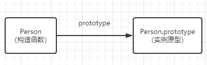
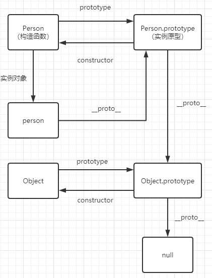

# 原型与原型链

## 原型

每一个构造函数都有一个prototype属性值，该值指向一个对象，而这个对象就是构造函数实例对象的原型

```js
function Person(){ }
Person.prototype.name = "zhangsan";
```

关系图如下：  
  


## 原型链

### constrctor

每个prototype对象都有一个constrctor属性指向关联的构造函数  

```js
function Person() { }
console.log(Person === Person.prototype.constructor); // true
```
关系图如下： 


### __proto__属性

每个实例对象都有一个__proto__属性。(prototype也有，因为prototype也是一个对象)  

```js
function Person() {

}
var person = new Person();
console.log(person.__proto__ === Person.prototype); // true
```

关系图如下： 


所以正是这些关联的指向构成了原型链。

### 原型的原型指向什么

在前面，我们已经讲了原型也是一个对象，那这个对象是由谁构造实例出来的呢？

我们可以通过原型的__proto__属性来查找。

```js
function Person(){

}
var person1 = new Person();
console.log(Person.prototype.__proto__.con); // Object
```

由此我们可以知道prototype是由Object构造实例出来的对象。

那Object.prototype的原型又是谁呢？

```js
console.log(Object.prototype.__proto__ === null) // true
```

是null  

那么完整的原型关系图如下  



## 补充

### 实例与原型

当读取实例属性时，实例属性不存在会是怎样呢？

```js
function Person() {

}

Person.prototype.name = 'zhangsan';

var person1 = new Person();
person1.name = 'lisi';
console.log(person1.name) // lisi

delete person1.name;
console.log(person1.name) // zhangsan
```

由此可以知道，当实例属性不存在时，回去原型上找，原型也没有时会再上一层原型直到Object再到null。
