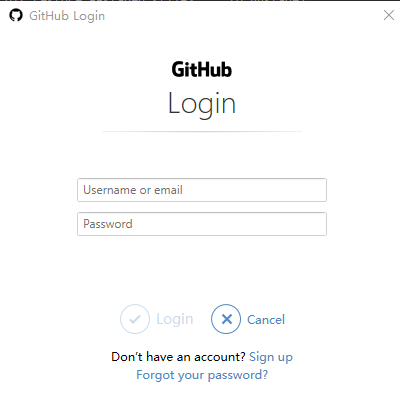

# Git

## 认识Git
Git 是目前世界上最先进的分布式版本控制系统。什么是版本控制？  
在你的不断开发中，功能肯定会越来越多，版本迭代越来越高。但是正常开发中，我们是没办法把项目移回上一个版本的（除非你自己手动复制保存每个版本的代码）。而 Git 则是帮我们实现这个。  

## 集中式和分布式

### 集中式（SVN）
所谓集中式版本控制系统就是版本库集中放在中央服务器，而干活的时候用的是自己。所以要先从服务器取得最新的版本，写完代码后，再把自己的代码推送到中央服务器。  
   
集中式最大的问题是必须联网才能工作。而且数据集中保存在服务器，导致服务器数据一丢失，那么所有的数据就会丢失。  

### 分布式（Git）
分布式版本控制系统则是每个人电脑都是服务器，都有完整的版本库。每个人之间都可以可以推送版本库修改。  
   
但通常都会以一台电脑充当”中央服务器“，方便大家交换修改。因为其实分布式，所以就算”中央服务器“崩溃，也不影响数据的保存，也不影响大家的工作。


## Git的工作区域
  
加上远程仓库，git则是共有三个工作区域  
* Workspace：工作区，本地代码存放位置
* Index/Stage：暂存区，执行 git add 指令后，保存修改文件的地方
* Repository：版本库，git commit 后的代码存放处。这里有我们提交到所有版本的数据，其中 HEAD 执行最新放入的版本。
* Remote：远程仓库，托管代码的服务器（其中代表 GitHub）。执行 git push 推送。  

## Git实践小Demo

## 前置
在实践之前，必须保证下载并安装了Git，而且配置了用户信息  
```
git config --global user.name "xxxxx" #配置用户名
git config --global user.email "xxxxx"  #配置用户邮箱
```

## 实践流程
1. 现在Github创建一个项目
2. 找一个空的文件夹，点击鼠标右键，然后选择 Git Base。进入后我们执行 git clone '地址' 把项目克隆下来  
  
这里使用的是 https，至于 SSH 稍后会讲  
3. 进入项目，创建一个 index.html 文件（随便编写写代码）
4. 继续打开 Git Base（在项目文件中打开，与第二步不同）
5. 执行 git add .(. 代表提交所有文件到暂存区，也可以使用指定文件名代替点来提交指定文件)，执行完毕后，没有任何提示则说明提交成功。我们也可以使用 git status 来查看提交情况。
  
6. 执行 git commit -m '注释' 把代码提交到版本库。注意此处注释在开发中要根据你写的代码进行注释，好让伙伴知道你提交了什么代码，完成了什么功能
  
7. 最后执行 git push，将代码推送到远程仓库。刷新一下 GitHub，你就能看到你提交的代码了。
  

当然，由于我们使用的是 https 来提交，所以在 git push 时需要进行登录和验证。  

 
 

::: tip
git push 默认提交到的是主分支（master），如果想提交到其它分支则需要指定分支。  
推送到指定的远程仓库：git push -u origin \<name\>   
显示所有远程仓库：git remote -v   
添加分支：git remote add ['name'] [url]  
删除分支：git remote rm \<name\>
:::

## 使用 SSH
上面推送到远程分支时，每次都要输入两次登录，这样会使得我们很麻烦。那能不能免登录推送呢？这就要用到 SSH 了。  
### 生成公钥
想使用 SSH，则必须先生成公钥。  
1. 打开 Git Base。执行 ssh-keygen -t rsa -C "xxxxx@xxxxx.com" ，这里的邮箱只是生成的 sshkey 的名称，并不约束或要求具体命名为某个邮箱。不过建议使用使用邮箱，有助于辨识。  
   
直接按照提示完成三次回车，即可生成 ssh key。
2. 打开图下的文件，然后复制其里面的内容
   
3. 把复制公钥添加到 github 上
  
4. 然后在 Git Base 里面，输入 ssh -T git@github.com测试连通性，出现下面提示后输入yes就代表成功了
  
5. 再次使用 git clone 拉取代码，这不过这次clone 后面的链接不再是 https，而是 ssh  
6. 之后重复上面 demo 的步骤，推送后发现不需要登录就直接成功了。  

::: tip
如果在连接时出现如下报错：ssh: connect to host github.com port 22: Connection refused  
* 在ssh文件夹下添加 config 文件（没有文件后缀），添加如下配置：  
Host github.com  
User xxxxx@xx.com  
Hostname ssh.github.com  
PreferredAuthentications publickey  
IdentityFile ~/.ssh/id_rsa  
Port 443
* 也可能是你所在网络禁止了 22 端口，切换个网络就行
:::

## 补充
当然 Git 除了以上这些外，还有分支管理 以及版本回溯等。  
如果你还有兴趣学习，那么推荐你去  [廖雪峰Git教程](https://www.liaoxuefeng.com/wiki/896043488029600)  

### .gitignore
在 git 提交本地或者推送到远程仓库时，有时有些文件我们是不需要提交和推送的，例如node_modules
、vue打包后的文件 dist等。  
那么我们可以在项目里添加个 .gitignore 的 txt 文件，里面配置了git提交时忽略的文件。  
```
// vue 项目默认的 .gitignore 配置
.DS_Store
node_modules
/dist


# local env files
.env.local
.env.*.local

# Log files
npm-debug.log*
yarn-debug.log*
yarn-error.log*
pnpm-debug.log*

# Editor directories and files
.idea
.vscode
*.suo
*.ntvs*
*.njsproj
*.sln
*.sw?

```
### 常用指令
* git config -l 查看git配置
* git clone \<url\>
* git add \<filename\> 也可以用 . 代表全部
* git commit -m ' '
* git push -u origin \<name\> 推送。 加上了-u参数，Git不但会把本地的master分支内容推送到远程新的master分支，还会把本地的master分支和远程的master分支关联起来，在以后的推送或者拉取时就可以简化命令。
* git pull origin \<name\> 更新本地代码
* git status 显示有变更的文件
* git remote -v 显示所有远程仓库
* git remote show '仓库名'
* git remote add \<'name'\> \<url\>
* git remote remove '仓库名'
* git checkout -b \<name\> -b 代表创建并切换分支
* git branch 查看本地分支（-a 所有分支 -r 远程分支）
::: tip
如果遇到 git branch -r 查看远程分支时，发现有缺少分支的情况。那么我们可以手动使用 git fetch origin 更新一下
:::
* git merge \<name\> 合并分支
* git branch -d \<name\> 删除分支
* git reset HEAD 撤销上一次的 add 操作。也可以在后面添加文件名来指定撤销某个文件
* git status 查看文件状态

### 报错解决
```
-refusing to merge unrelated histories
```
git pull origin master --allow-unrelated-histories