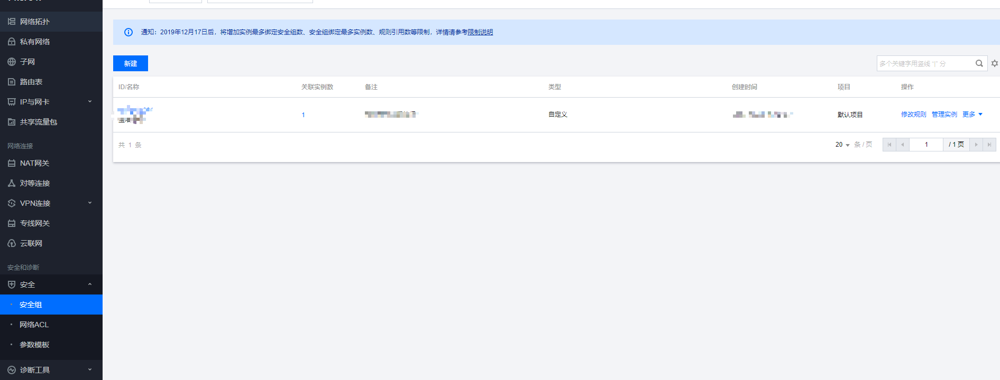
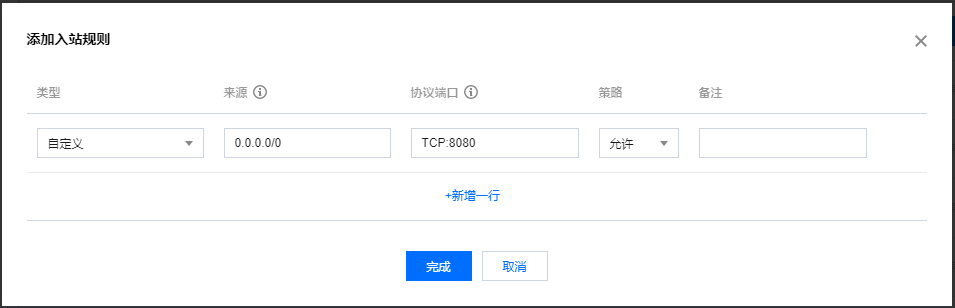

# Koa部署到腾讯云服务器

## 第一步

- 现在服务器上装上Node
- 把本地Koa项目移植到服务器，运行项目

## 第二步

此时项目虽然在服务器上运行，但是如果你用 ip 地址来请求接口会发现，依然请求不了。
这是因为腾讯云上没有配置安全组，也就是没有开发服务器上的指定端口。 

首先进入腾讯云服务器，点击安全组，没有的就新建

进入安全组后，我们可以看到有入站规则和出站规则两个。 

入站规则：配置外网访问服务器
出站规则：配置服务器能访问那些外网

然后我们点击添加规则

来源：指的是那些ip+端口可以访问, 0.0.0.0/0 表示全部即任何人都可以访问
协议端口：指的是可以访问服务器上那个端口（也就是你项目的端口）

## 第三步
在项目配置里把ip地址改成 0.0.0.0 就行。为什么是 0.0.0.0?  

这时应为在计算机网络中把全0的主机号字段表示该IP地址是“本主机”所连接的单个网络地址。
