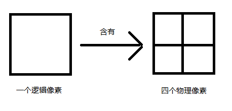

# 移动端适配方案

## 先导 像素的认识

### 1. 物理像素
设备屏幕实际拥有的像素点，屏幕的基本单元。在出厂的时候，厂家就已经设置好了，不能改变。
例如 iPhone 6 的屏幕宽度有 750 个像素点，高度有 1334 个像素点

### 2. 逻辑像素（设备独立像素） dip
CSS使用的就是逻辑像素。在一个设备中逻辑像素不一定会和物理像素相等。 
在 iPhone6 中逻辑像素 为 375 * 667px

### 3. 像素比 dpr(device pixel ratio)
官方的定义为：物理像素与逻辑像素之间的比例。  
那么由上面我们可以知道 iPhone6 的像素比为 drp = 2，也就是：



<!-- ### 4. 移动端图片选择
以 iPhone6 为例子，其逻辑像素为 375 * 667px，那么使用宽 375px 的图片就能
正常显示了，但是如果追求图片更好的色彩，那么也可以使用750px、960px、2560px的图片 -->

<!-- ## 一、百分比布局
利用百分比单位 % 来适应各种不同屏幕的响应式效果，使得页面的组件能根据屏幕的宽度或高度的改变而改变。  
缺点：大量的使用百分比会使布局变得困难，所以百分比适合比较简单的页面。（现在一般都不会单纯的使用一种方式来布局） -->

## 一、媒体查询@media
通过查询不同媒体类型以及宽度或高度，来针对使用不同的样式。从而达到响应式效果。
代码示例
```
@media screen and (min-width:1200px) {
	//css代码
}
@media screen and (min-width:992px) {
	//css代码
}
```
缺点：需要编写多套 CSS 代码

<!-- ## 三、viewport视口适配
手机游览器是把页面放在一个虚拟的窗口 viewport 中的，通常情况下这个虚拟的窗口比屏幕宽，这样就不用把每个网页挤到很小的窗口中，用户可以通过平移和缩放来看网页的内容。viewport就是让网页开发者通过其大小，动态的设置其网页内容中控件元素的大小,从而使得在浏览器上实现和web网页中相同的效果(比例缩小)。

### viewport配置
1. width=device-width ：表示宽度等于设备屏幕的宽度（也可以等于一个正整数）
1. initial-scale=1.0：表示初始的缩放比例（页面初始加载时的默认比例）
3. minimum-scale=1.0：表示允许用户缩放的最小比例
4. maximum-scale=1.0：表示允许用户缩放的最大比例
5. user-scalable=no：表示用户是否可以手动缩放（no为不允许，yes为允许）

### viewport用法
1. vw：1vw等于视口宽度的1%
2. vh：1vh等于视口高度的1%。    
3. vmin：选取vw和vh中最小的那个。    
4. vmax：选取vw和vh中最大的那个。    

例如 iphone4 里的逻辑像素为 320px * 480px，那么 1vw = 320/100 = 3.2px,    
1vh = 480/100 = 4.8px -->


## 二、rem适配

### 什么是 rem
CSS3新增的属性，其值得相对大小是根据 html 的font-size来计算大小    
例如：html 的 font-sizde=100px 那么子节点的 1rem 的大小就为 100px

### 1、JS动态设置
在开发之前应先选择一种模板（设计稿也要根据此模板大小来开发），假如选择的是iphone6（375 * 667），那么可以设置fontSize的值为 375 / 3.75 = 100px，那么 1rem = 100px。
```js
window.onload = function() {
	let html = document.documentElement
	let clientW = html.clientWidth
	html.style.fontSize = clientW/3.75 + 'px'
}
```
某个盒子属性
```css
.box {
	width: .25rem
}
```
那个这个盒子在 iphone6 里面的宽度为 25px，如果换个手机，其逻辑像素为 750，为iphone6的两倍。那么这个盒子宽度就变成 50px。也刚好是iphone6的两倍。


缺点：JS没有和CSS进行解耦

### 2、CSS calc()函数
通过使用calc来计算出 font-size 的大小
```css
html {
	font-size: calc(100vw / 3.75);
	font-size: -moz-calc(100vw / 3.75);
	font-size: -webkit-calc(100vw / 3.75);
}
```
缺点1、：只兼容IE9及以上

### 3、vm加上 rem
依然以 iphone6 为例
```css
html {
	/* 
		375 / 100 = 3.75 即 1vw = 3.75px
		那么 1px 等于多少 vw 呢？ 1 / 3.75 = 0.2666666vw	
	 */
	font-size: 0.26666666vw;
}
```
备注：这里是 1px = 1rem

::: tip
如果只在 html 设置font-size的话，那么会影响内容的布局。例如：字体太大或者图片缩小后位置不对等问题，所以建议在 body 下把字体设置回正常（.12rem/12px）
:::

<!-- ## 五、Flex布局（弹性布局）
Flex 布局是 CSS3 新出的一种布局方式。这里就不做多介绍。
缺点：只兼容IE10及以上 -->

## 三、rpx
可以根据屏幕宽度进行自适应。规定屏幕宽为750rpx。如在 iPhone6 上，屏幕宽度（逻辑像素）为375px，共有750个物理像素，则750rpx = 375px = 750物理像素，1rpx = 0.5px = 1物理像素。  
|  设备   | rpx换算px(屏幕宽度/750)  |  px换算rpx(750/屏幕宽度)  |  
|  ----  | ----  |  ----  |  
| iPone5  | 1rpx = 0.42px |  1px = 2.34rpx  |  
| iPone6  | 1rpx = 0.5px |  1px = 2rpx  |  
| iPone6 Plus  | 1rpx = 0.552px |  1px = 1.81rpx  |  

## 经典问题

### 移动端如何实现1px效果

#### 产生1px原因
物理像素和逻辑像素不对应。加入物理像素和逻辑像素的比例为2dpr，那么说明1px的高度实际为2px高度的物理像素。参考上面像素比。而我们看到的页面效果是按物理像素来说的。那么这时想展示1px物理像素，那么逻辑像素则需要 0.5px。
但是这在安卓端是不行的（苹果可以），安卓会把 0.5px 直接变成 0px。

### 解决方案
1. 使用box-shadow
```css
.box-shadow-1px {
	box-shadow: inset 0px -1px 1px -1px #c8c7cc;
}
```
2. 伪类 + 缩放
```css
div {
  height: 1px;
  background: #000;
  transform: scaleY(0.5);
  transform-origin: 0 0;
  overflow: hidden;
}
```