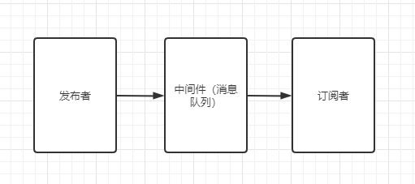
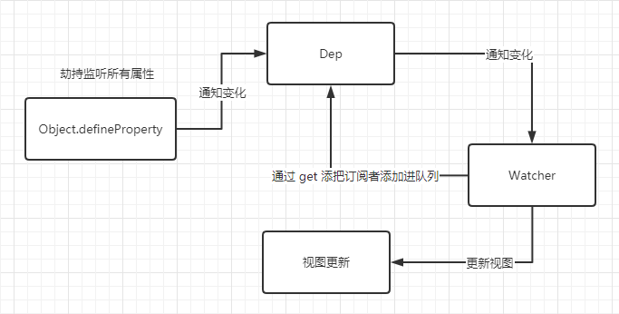
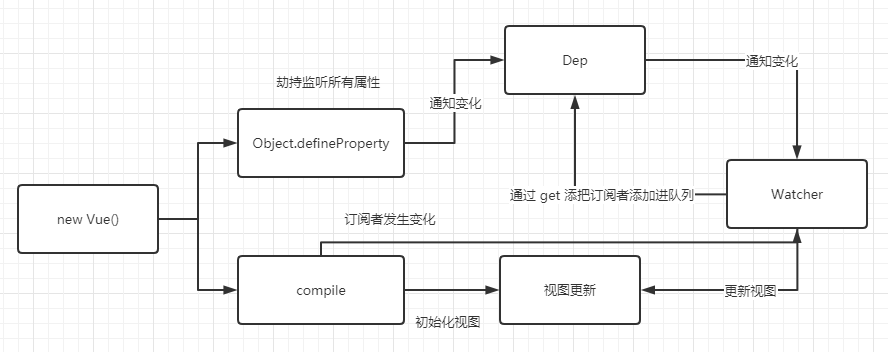

# vue双向绑定
本文参考了[vue双向绑定原理](https://juejin.cn/post/6844903616046710791)

## defineProperty
我们都知道vue是使用defineProperty来实现双向绑定的，那么这个defineProperty到底是什么呢？  

### 了解defineProperty
Object.defineProperty() 方法会直接在一个对象上定义一个新属性，或者修改一个对象的现有属性，并返回此对象。  

Object.defineProperty(obj, prop, descriptor)有三个参数:  
* obj 要定义属性的对象
* prop 要定义或修改的属性的名称或 Symbol
* descriptor 要定义或修改的属性描述符。  

其中最关键的是 descriptor 的值，其值有 6 个：
* configurable 该值为 true 时，该属性的描述符才能够被改变，同时该属性也能从对应的对象上被删除。默认为 false
* enumerable 该值为 true 时，该属性才会出现在对象的枚举属性中。默认为 false
* value 获取该属性的值
* writable 该值为 true 时，设置该属性能被赋值运算符（=）改变。默认为 false。
* get 属性的 getter 函数，当访问该属性时，会调用此函数。
* set 属性的 setter 函数，当属性值被修改时，会调用此函数。  

而 vue 的双向绑定正是使用了 get 和 set 这两个函数。

::: tip
在ES6中，由于 Symbol类型的特殊性，用Symbol类型的值来做对象的key与常规的定义或修改不同，而Object.defineProperty 是定义key为Symbol的属性的方法之一。
:::

## 最简单版双向绑定
现在让我们想一想双向绑定到底是什么样子的。当对象某个属性值改变时，视图会相应的改变，当视图的值改变的时候，属性的值也会改变。  

那么现在让我们来实现第一步，对象属性值改变时，视图也跟着改变。

### 第一版
使用 defineProperty 的 set 函数。当属性值改变时会调用 set 函数，那么我们在函数里面设置改变视图不就行了吗？想一想，是不是可以？让我们立刻来动手。  

```html
<span id="name">这是旧值</span>
```
首先是 html 代码
```js
var obj = {};
Object.defineProperty(obj, 'name', {
    set: function(newVal) {
        document.getElementById('name').innerHTML = newVal;
    }
})
setTimeout(function(){
    console.log(111)
    obj.name = "hello"
}, 2000)
```
整个过程是：
1. 先创建一个对象obj
2. 然后利用 Object.defineProperty() 给 obj 定义一个新的属性 name
3. 设置了该属性的set 方法。每当属性值改变的时候，都会通过调用 set 函数进而改变视图。  

### 第二版
现在是对象属性值改变后，成功的也让视图也更新了。那么现在我们来实现视图的更新后，让对象的属性值也更新。

很简单，一般视图的改变基本都是输入框。所以我们先添加个输入框。
```html
<input id="a">
```
然后再监听输入框的操作，进而来修改 obj 的属性值。
```js
document.addEventListener('input', function(e){
    obj.name = e.target.value;
})
```
就这样最简单版本的双向绑定就完成了。  

## 进阶版双向绑定
虽然上面是实现了双向绑定的效果，但是每个对象的属性都要自己手动来通知视图改变吗？这样实在是太麻烦了。我们可以使用发布 —订阅的设计模式来实现一次通知，所有响应视图都改变的效果。

### 发布 —订阅设计模式
发布 —订阅设计模式是定义对象间的一种一对多的依赖关系，当一个对象的状态改变时，所有依赖于它的对象都将得到通知。 



::: tip
有很多地方吧发布-订阅模式和观察者模式混淆了，觉得两者是同一个东西。其实不是，观察者模式和发布-订阅模式最大的区别在于：观察者模式是直接通知被观察者发生变化的。而发布-订阅模式则是通过一个中间件（消息队列）通知订阅者发生变化，并不与订阅者产生直接的接触，这就是低耦合。
:::

#### 优点
* 发布-订阅模式广泛应用于异步编程中，这是一种替代传递回调函数的方案，比如，我们可以订阅 ajax 请求的 error success 等事件。在异步编程中使用发布-订阅模式， 我们就无需过多关注对象在异步运行期间的内部状态，而只需要订阅感兴趣的事件发生点。  

* 发布-订阅模式可以取代对象之间硬编码的通知机制，一个对象不用再显式地调用另外一个对象的某个接口。发布-订阅模式让两个对象松耦合地联系在一起，虽然不太清楚彼此的细节，但这不影响它们之间相互通信。当有新的订阅者出现时，发布者的代码不需要任何修改；同样发布者需要改变时，也不会影响到之前的订阅者。只要之前约定的事件名没有变化，就 可以自由地改变它们。

### 实现发布-订阅模式

#### 简单实现发布-订阅模式
发布-订阅模式其实不难，只要我们按照上图创建即可。
```js
// 一个发布者publisher
var pub = {
    publish: function() {
        dep.notify()
    }
}

// 三个订阅者
var sub1 = { update: function(){ console.log(1) } };
var sub2 = { update: function(){ console.log(2) } };

function Dep() {
    this.subs = [ sub1, sub2, sub3] // 使用一个队列将订阅者保存起来
}

Dep.prototype.notify = function() {
    this.subs.forEach(function(sub) {
        sub.update()
    })
}

var dep = new Dep();
pub.publish()
```
首先是发布者 pub，它拥有一个发布功能 publish()，通过该功能就能调用订阅者队列的遍历函数notify()，订阅者队列逐个遍历订阅者，并且调用订阅者的更新功能 update()。  

把这个功能转到 vue 就是对象属性(发布者)，拥有一个发布功能 publish()，通过该功能就能调用订阅者队列的遍历函数notify()，订阅者队列逐个遍历订阅者，并且调用订阅者的更新功能 update()，update() 其实就是更新视图函数。

### 实现 vue 的发布-订阅模式
当然 vue 的订阅者不会那么简单，所以我们得先把订阅者修改一下。
#### vue 的订阅者实现
```js
function Watcher(vm, node, name) {
    Dep.target = this;
    this.name = name;  // 对象属性的名称
    this.node = node;  // 对象属性对应的 dom
    this.vm = vm;
    // 首次调用，把订阅者放进队列，并且更新视图
    this.update();
    Dep.target = null;
}

Watcher.prototype = {
    update: function() {
        this.get();  // 触发get 将watcher放入subs
        this.node.innerHTML = this.value
    },
    get: function() {
        this.value = this.vm[this.name];
    }
}
```
订阅者里面有两个方法，get()是获取 data 里面的属性值，update()则是将值更新到 dom 上。  

#### defineProperty 封装
接下来是 defineProperty，我们将其封装一下。  
```js
function defineReactive(obj, key, val) {
    var dep = new Dep();  // 每一个 data 的属性都对应着一个属于自己的队列
    Object.defineProperty(obj, key, {
        get: function() {
            if(Dep.target) dep.addSub(Dep.target)
            return val
        },
        set: function(newVal) {
            if(newVal === val) return
            val = newVal;
            dep.notify()  // 通知队列更新视图
        }
    })
}
```
上面的订阅者 Watcher 在创建的时候会默认调用一次 update 函数，而 update 函数会调用 get 函数来获取 data 里面相应的值，从而触发了 Object.defineProperty 的 get，实现了把 Watcher 添加进队列。  

#### 完整代码
```js
function Dep() {
    this.subs = []
}

Dep.prototype.notify = function() {
    this.subs.forEach(function(sub) {
        sub.update()
    })
}

Dep.prototype.addSub = function(sub) {
    this.subs.push(sub)
}

function Watcher(vm, node, name) {
    Dep.target = this;
    this.name = name;
    this.node = node;
    this.vm = vm;
    // 触发get 将watcher放入subs
    this.update();
    Dep.target = null;
}

Watcher.prototype = {
    update: function() {
        this.get();
        this.node.innerHTML = this.value
    },
    get: function() {
        this.value = this.vm[this.name];
    }
}

function defineReactive(obj, key, val) {
    var dep = new Dep();
    Object.defineProperty(obj, key, {
        get: function() {
            if(Dep.target) dep.addSub(Dep.target)
            return val
        },
        set: function(newVal) {
            if(newVal === val) return
            val = newVal;
            dep.notify()
        }
    })
}

var data = {};
defineReactive(data, 'name', '初始值')
new Watcher(data, document.getElementById('name'), 'name')
setTimeout(function(){
    data.name = "hello"
}, 2000)
```
目前整个流程图如下：
  

虽然目前我们实现了用发布-订阅模式实现了自更新，但是还有一个缺点。那就是每个 data 属性相关的 Dom 还需要我们自己手动添加。  

### Compile 解析器
compile主要做的事情是解析模板指令，将模板中的变量替换成数据，然后初始化渲染页面视图，并将每个指令对应的节点绑定更新函数，添加监听数据的订阅者，一旦数据有变动，收到通知，更新视图


因为遍历解析的过程有多次操作dom节点，为提高性能和效率，会先将跟节点el转换成文档碎片fragment进行解析编译操作，解析完成，再将fragment添加回原来的真实dom节点中  
```js
function nodeToFragment(node, vm) {
    var flag = document.createDocumentFragment();
    var child;

    while(child = node.firstChild) {
        complie(child, vm);
        flag.append(child);
    }

    return flag;
}

function complie(node, vm) {
    var reg = /\{\{(.*)\}\}/;

    if(node.nodeType === 1) {  // 注意结点类型为 1是元素结点，不一定是输入框，也有可能是 div等，这里不做更多的判断
        var attr = node.attributes;

        for(var i=0; i<attr.length; i++) {
            if(attr[i].nodeName == 'v-model') {
                var name = attr[i].nodeValue;

                node.addEventListener('input', function(e) {
                    vm[name] = e.target.value;
                })

                node.value = vm[name];
                node.removeAttribute('v-model');
            }
        }
    }
    // 节点类型为text
    if(node.nodeType === 3) {
        if(reg.test(node.nodeValue)) {
            var name = RegExp.$1;
            name = name.trim();

            new Watcher(vm, node, name);
            node.nodeValue = vm[name];
        }
    }
}
```
解析器通过 vue 的根节点进行遍历，如果结点类型为 text，那么就创建订阅者进而把订阅者放进队列。如果是元素结点那么进行元素结点的操作。


完整代码如下：
```html
<!DOCTYPE html>
<html lang="en">
<head>
    <meta charset="UTF-8">
    <meta name="viewport" content="width=device-width, initial-scale=1.0">
    <title>Document</title>
</head>
<body>
    <div id="app">
        <input v-model="text"><br/>
        {{ text }}
    </div>
</body>
</html>
<script>
    function Dep() {
        this.subs = []
    }

    Dep.prototype.notify = function() {
        this.subs.forEach(function(sub) {
            sub.update()
        })
    }
    
    Dep.prototype.addSub = function(sub) {
        this.subs.push(sub)
    }

    function complie(node, vm) {
        var reg = /\{\{(.*)\}\}/;

        if(node.nodeType === 1) {
            var attr = node.attributes;

            for(var i=0; i<attr.length; i++) {
                if(attr[i].nodeName == 'v-model') {
                    var name = attr[i].nodeValue;

                    node.addEventListener('input', function(e) {
                        vm[name] = e.target.value;
                    })

                    node.value = vm[name];
                    node.removeAttribute('v-model');
                }
            }
        }
        // 节点类型为text
        if(node.nodeType === 3) {
            if(reg.test(node.nodeValue)) {
                var name = RegExp.$1;
                name = name.trim();

                new Watcher(vm, node, name);
                node.nodeValue = vm[name];
            }
        }
    }

    function nodeToFragment(node, vm) {
        var flag = document.createDocumentFragment();
        var child;

        while(child = node.firstChild) {
            complie(child, vm);
            flag.append(child);
        }

        return flag;
    }

    function defineReactive(obj, key, val) {
        var dep = new Dep();
        Object.defineProperty(obj, key, {
            get: function() {
                if(Dep.target) dep.addSub(Dep.target)
                return val
            },
            set: function(newVal) {
                if(newVal === val) return
                val = newVal;
                dep.notify()
            }
        })
    }

    // 观察   对data对象使用defineProperty进行设置取值和赋值操作
    function observe(obj, vm) {
        Object.keys(obj).forEach(function(key) {
            defineReactive(vm, key, obj[key]);
        })
    }

    function Watcher(vm, node, name) {
        Dep.target = this;
        this.name = name;
        this.node = node;
        this.vm = vm;
        // 触发get 将watcher放入subs
        this.update();
        Dep.target = null;
    }

    Watcher.prototype = {
        update: function() {
            this.get();
            this.node.nodeValue = this.value;
        },
        get: function() {
            this.value = this.vm[this.name];
        }
    }

    function Vue(options) {
        this.data = options.data;
        var data = this.data;

        observe(data, this);

        var id = options.el;
        var dom = nodeToFragment(document.getElementById(id), this);
        document.getElementById(id).appendChild(dom);
    }

    var vm = new Vue({
        el: 'app',
        data: {
            text: 'hello world'
        }
    })
</script>
```

完整的流程图如下：
 