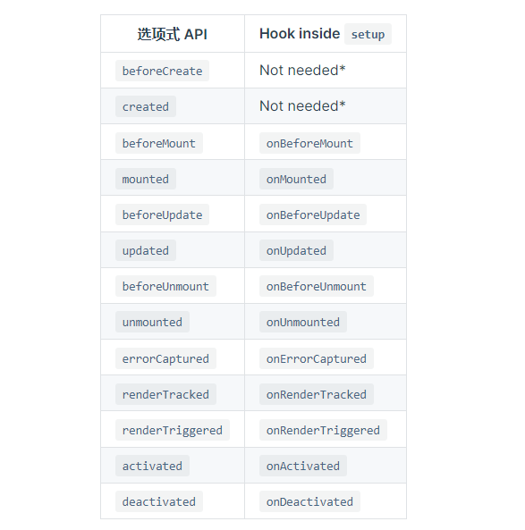

# vue3使用指南

## 组合式API（setup）
setup 选项在组件创建之前执行，一旦 props 被解析，就将作为组合式 API 的入口。  

### 在组件创建之前执行
由于setup在组件创建之前执行，所以我们在 setup 里面使用不了 this。这是因为 setup 执行的时候 vue 实例还没创建完毕（setup 运行围绕着beforeCreate 和 created 生命周期钩子），所以vue并没有给 setup 绑定 this 的指向自身。  

所以想在 setup 中定义双向绑定的变量、定义生命周期等操作都得借助引入外部函数来实现。  

## setup使用方式

### setup函数
直接 vue2 使用方式上添加一个 setup 函数  
```js
export default {
  props: {
    title: String
  },
  setup(props, content) {
    console.log(props.title)
  }
}
```
该方式 setup 接受两个参数。  
* props：通过 props 可以获得组件传过来的值
* content: context 是一个普通 JavaScript 对象，暴露了其它可能在 setup 中有用的值  

### 单文件组件方式
像引入 js 文件方式一样，在里面可以直接书写 setup 相关代码。
```js
<script setup>
</script>
```
优点：可以直接省略 return 和 components 的书写  

## 创建响应式数据

## ref
ref函数仅能监听基本类型的变化，不能监听复杂类型的变化（比如对象、数组）
```js
const count = ref(0)
```
ref 对象仅有一个 .value property，指向该内部值。
```js
console.log(count.value) // 0

count.value++
console.log(count.value) // 1
```
如果将对象分配为 ref 值，则它将被 reactive 函数处理为深层的响应式对象。

## reactive
复杂类型则使用 reactive 创建响应式数据
```js
const obj = reactive({ count: 0 })
```
操作里面的值则不需要想 ref 那样使用 value
```js
console.log(obj.count) // 0
```

## 使用生命周期
想在组合API中使用生命周期，必需先引入生命周期函数。  
```js
import { onMounted } from 'vue'

export default {
  setup() {
    onMounted(() => {
      console.log('Component is mounted!')
    })
  }
}
```
可以看到相对于 vue2 的 mounted 命名多了一个 on。是的，在组合式API中所用生命周期命名前面都多了一个on。但是 beforeCreate 和 created 除外，因为组合式API就是围绕他俩运行的，所以在组合式API中并不支持这两个生命周期。  

  

## 使用props和$emit
使用props
```js
const props = defineProps({
    dialogVisible: {
        type: Boolean,
        require: true
    }
})

props.dialogVisible
```

使用emit
```js
const emit = defineEmits(['closeDialog'])
emit('closeDialog')
```

## 获取DOM
首先跟 vue2 一样，先在 dom 上定义 ref 名称。  
```html
<div ref="domRef"></div>
```
由于 setup 中不存在 this 指向实例，所以需要通过 ref 来创建一个变量指向 dom。  
```js
let domRef = ref(null)
```
需要注意两个点：  
* 变量名字必须跟 dom 上定义 ref 的名字一致
* 定义的值必须为 null
* 如果是函数书写方式，则需要 return 出去
